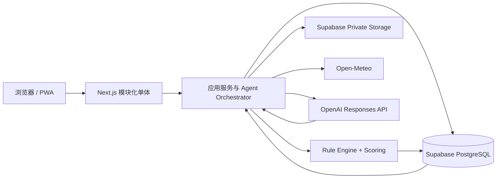
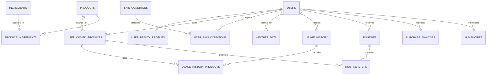
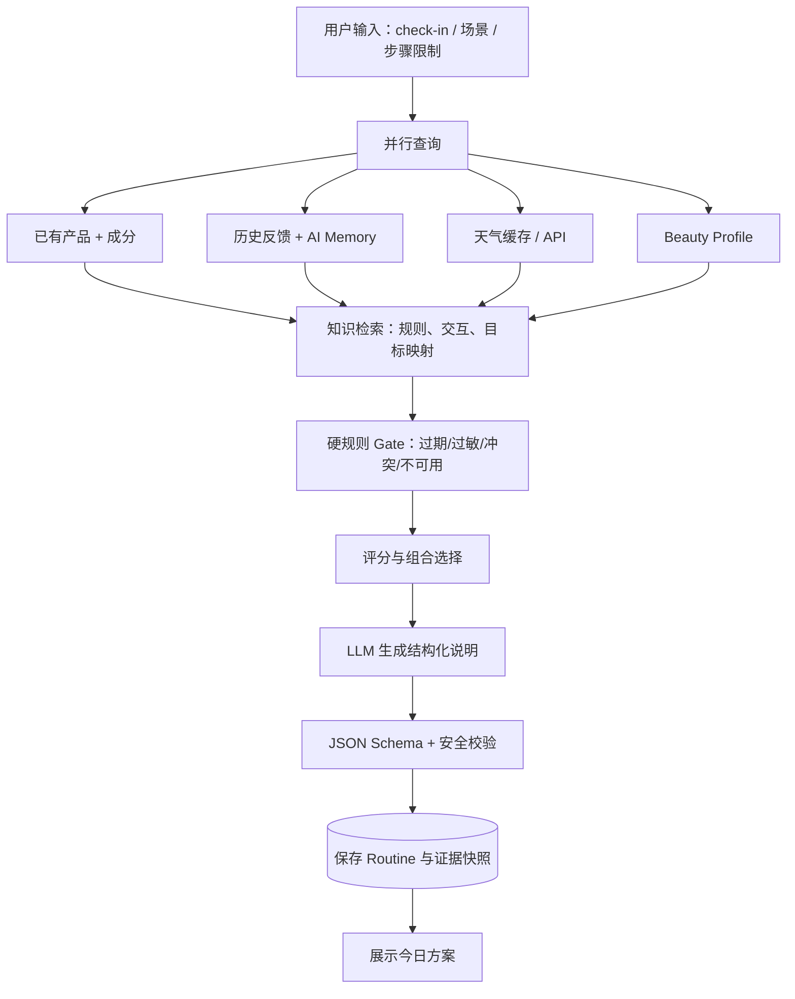

# Beauty OS 技术设计方案

> 版本：v0.1（个人使用 MVP）  
> 日期：2026-08-18  
> 状态：待产品确认；本阶段不包含代码实现

## 0. 设计结论

Beauty OS 的第一版应采用**模块化单体 WebApp**：一个 Next.js 应用承载页面、API 和业务编排；Supabase 提供 PostgreSQL、身份认证和私有对象存储；OpenAI Responses API 负责图片/文本理解及自然语言解释；确定性的 Rule Engine 与 Scoring System 负责安全约束、产品选择和购买判断。

核心原则是：

1. AI 不直接从所有产品中“自由推荐”。系统先查询用户资产，再由规则过滤和评分，AI 只在受控候选集上解释结果。
2. 每一个建议都必须说明“为什么使用、为什么不使用、依据了哪些数据”。
3. 默认优先消耗已有、已开封、临期且适配的产品；不以促进购买为目标。
4. 首版的六个 Agent 是同一后端中的六个领域模块，不是六个微服务，也不是六个互相聊天的自治进程。
5. 护肤建议属于生活方式辅助，不做疾病诊断；出现持续红肿、疼痛、破损等风险信号时停止推荐活性成分并提示线下就医。

### 0.1 MVP 边界

包含：

- 个人账号与美妆档案
- 已有护肤品/彩妆资产管理
- 标签或包装图片辅助录入，用户确认后入库
- 每日皮肤状态记录
- 天气获取与缓存
- 今日护肤、今日彩妆方案
- 使用反馈与历史
- 新产品购买分析
- 可解释评分与基础 AI 记忆

明确不包含：

- 电商、下单、返佣、价格比价
- 社区、关注、评论、分享、广告
- 复杂会员和多租户管理
- 医疗诊断或处方建议
- 自动抓取全网商品数据
- 第一版的机器学习、向量数据库、微服务、消息队列、Kubernetes

---

## 1. 推荐技术架构

### 1.1 总体架构



推荐请求路径：

```text
UI → /api/v1 Route Handler → Application Service → Repository / Integration
                                      ↓
                           Rule Engine / Agent Modules
                                      ↓
                      PostgreSQL / Storage / OpenAI / Weather
```

### 1.2 Frontend

| 项目 | 选择 | MVP 用途 |
|---|---|---|
| 框架 | Next.js App Router + React + TypeScript | 页面、服务端组件、表单和 API 使用同一工程 |
| UI | Tailwind CSS + shadcn/ui | 快速建立一致的移动优先界面 |
| 表单校验 | React Hook Form + Zod | 复用前后端输入结构与错误提示 |
| 服务端数据 | Server Components | 仪表盘、资产列表、今日方案首屏加载 |
| 客户端请求 | TanStack Query（仅需要轮询/乐观更新处） | 图片分析状态、反馈提交；避免全局滥用 |
| 图表 | 首版不引入；需要时使用轻量 SVG/CSS | 先保证核心任务流，不做复杂数据看板 |
| PWA | 第二个迭代启用 | 添加到主屏、相机上传、弱网体验 |

主要页面：

- `/today`：今日护肤和彩妆方案、天气、风险提示
- `/inventory`：已有产品、开封/到期/余量状态
- `/inventory/new`：手工或图片录入产品
- `/check-in`：今日皮肤状态
- `/history`：使用记录与反馈
- `/purchase-advisor`：候选新品录入与购买分析
- `/profile`：皮肤目标、敏感项、位置与偏好

### 1.3 Backend

采用 Next.js Route Handlers 构成 BFF/API 层，领域逻辑放在独立的 `src/server` 与 `src/domain`，不写进页面组件或 Route Handler。

后端分层：

1. **API Layer**：鉴权、Zod 校验、幂等键、HTTP 状态码。
2. **Application Layer**：用例编排，例如 `GenerateDailyRoutine`。
3. **Domain Layer**：产品、皮肤、方案、购买分析等实体和值对象。
4. **Rule Layer**：纯函数式规则、硬性约束、评分与选择。
5. **Agent Layer**：受控输入/输出的 AI 能力模块。
6. **Repository Layer**：数据库读写，不包含业务判断。
7. **Integration Layer**：OpenAI、天气、对象存储适配器。

首版不单独建设 Python/FastAPI 服务。若以后需要批量数据清洗或自训练模型，再通过稳定接口拆出 AI worker，不改变前端 API。

### 1.4 Database

- Supabase 托管 PostgreSQL。
- Drizzle ORM + SQL migration：类型安全，同时保留 PostgreSQL 原生能力。
- 所有用户数据表带 `user_id`，开启 Row Level Security（RLS）。
- 主键统一 UUID；时间统一存 `timestamptz`；用户界面按 `users.timezone` 展示。
- 灵活但需要审计的快照使用 `jsonb`；核心关系仍用外键，不把所有数据塞进 JSON。
- 第一版用 SQL、标签和规则检索知识，不依赖向量检索。未来确有语义检索需求时，可在同一 PostgreSQL 中启用 pgvector。

### 1.5 AI Architecture

AI 采用“确定性内核 + 生成式外壳”：

- **确定性内核**：规则过滤、冲突检测、评分、选择顺序、库存约束。
- **生成式外壳**：图片信息抽取、名称/成分归一化建议、理由生成、对用户反馈做结构化总结。
- **接口**：OpenAI Responses API。
- **输出**：所有业务输出使用 JSON Schema/Structured Outputs 校验；校验失败最多重试一次，仍失败则返回规则引擎的模板化结果。
- **模型路由**：模型 ID 通过环境变量配置。成本敏感的抽取/解释使用当前小型多模态模型；复杂且低频的购买分析使用平衡型模型。以当前官方型号为例，可用 `gpt-5.6-luna` 与 `gpt-5.6-terra`，但不得把型号硬编码进领域逻辑。
- **知识检索**：先从产品、成分、皮肤目标、交互规则和 AI Memory 表中构造最小上下文，不把全库发送给模型。
- **可追溯性**：保存 `model`、`prompt_version`、`rule_version`、输入摘要、结构化输出、耗时、token 使用量和错误码。

### 1.6 Storage

Supabase Storage 建立私有 bucket：

| Bucket | 内容 | 保留策略 |
|---|---|---|
| `product-images` | 产品正面、背面、成分表 | 用户删除产品后进入延迟清理 |
| `skin-checkins` | 可选的皮肤状态图片 | 默认不长期保留；分析后删除或按用户设置保留 |
| `exports` | 用户数据导出文件 | 短期签名 URL，定时清理 |

上传使用“服务端签发路径/权限 → 浏览器直传 Storage → 完成回调”的方式，避免大文件经过应用服务器。限制 MIME、文件大小和像素；去除 EXIF 定位信息；下载只使用短期 signed URL。

### 1.7 Deployment

| 环境 | Web | 数据库/认证/存储 | 外部服务 |
|---|---|---|---|
| Local | Next.js dev | Supabase local 或独立开发项目 | OpenAI test project、Open-Meteo |
| Preview | Vercel Preview | Supabase staging | 独立密钥 |
| Production | Vercel | Supabase production | 独立生产密钥 |

部署策略：

- Git 分支触发 Preview，主分支触发 Production。
- 数据库 migration 在部署前执行，禁止应用启动时自动改表。
- 天气数据按位置和小时缓存 30–60 分钟；今日方案按 `user + local_date + profile_version + inventory_version` 幂等生成。
- 第一版不需要 Redis：数据库表加唯一约束即可实现幂等和轻量任务状态。
- AI 调用超时或失败时，返回规则引擎可读结果；不让整个今日页不可用。
- 监控至少包含：API 错误率、AI 失败率、结构化输出失败、天气降级、生成耗时和每日成本。

---

## 2. 项目目录结构

```text
beauty-os/
├─ src/
│  ├─ app/
│  │  ├─ (auth)/
│  │  │  └─ login/page.tsx
│  │  ├─ (app)/
│  │  │  ├─ today/page.tsx
│  │  │  ├─ inventory/page.tsx
│  │  │  ├─ inventory/new/page.tsx
│  │  │  ├─ check-in/page.tsx
│  │  │  ├─ history/page.tsx
│  │  │  ├─ purchase-advisor/page.tsx
│  │  │  └─ profile/page.tsx
│  │  └─ api/v1/
│  │     ├─ me/route.ts
│  │     ├─ profile/route.ts
│  │     ├─ products/route.ts
│  │     ├─ owned-products/route.ts
│  │     ├─ uploads/route.ts
│  │     ├─ skin-checkins/route.ts
│  │     ├─ routines/daily/route.ts
│  │     ├─ routines/[id]/feedback/route.ts
│  │     ├─ ai/product-recognition/route.ts
│  │     └─ purchase-analyses/route.ts
│  ├─ components/
│  │  ├─ ui/
│  │  ├─ inventory/
│  │  ├─ routine/
│  │  └─ purchase/
│  ├─ features/
│  │  ├─ auth/
│  │  ├─ profile/
│  │  ├─ inventory/
│  │  ├─ check-in/
│  │  ├─ routine/
│  │  └─ purchase/
│  ├─ domain/
│  │  ├─ product/
│  │  ├─ ingredient/
│  │  ├─ skin/
│  │  ├─ weather/
│  │  ├─ routine/
│  │  └─ purchase/
│  ├─ server/
│  │  ├─ application/
│  │  │  ├─ generate-daily-routine.ts
│  │  │  ├─ analyze-purchase.ts
│  │  │  └─ record-usage-feedback.ts
│  │  ├─ agents/
│  │  │  ├─ orchestrator.ts
│  │  │  ├─ product-intelligence.ts
│  │  │  ├─ ingredient-intelligence.ts
│  │  │  ├─ skin-analysis.ts
│  │  │  ├─ weather-intelligence.ts
│  │  │  ├─ routine-planning.ts
│  │  │  └─ purchase-advisor.ts
│  │  ├─ prompts/
│  │  │  ├─ product/v1.ts
│  │  │  ├─ routine/v1.ts
│  │  │  └─ purchase/v1.ts
│  │  ├─ schemas/
│  │  │  ├─ agent-inputs.ts
│  │  │  └─ agent-outputs.ts
│  │  ├─ rules/
│  │  │  ├─ eligibility.ts
│  │  │  ├─ ingredient-conflicts.ts
│  │  │  ├─ routine-score.ts
│  │  │  ├─ purchase-score.ts
│  │  │  └─ versions.ts
│  │  ├─ repositories/
│  │  ├─ integrations/
│  │  │  ├─ openai/
│  │  │  ├─ weather/
│  │  │  └─ storage/
│  │  ├─ auth/
│  │  └─ observability/
│  ├─ db/
│  │  ├─ schema/
│  │  ├─ migrations/
│  │  ├─ seeds/
│  │  └─ client.ts
│  └─ shared/
│     ├─ errors/
│     ├─ result/
│     ├─ constants/
│     └─ types/
├─ tests/
│  ├─ unit/rules/
│  ├─ integration/api/
│  ├─ e2e/
│  └─ fixtures/
├─ docs/
│  ├─ api/
│  ├─ rules/
│  └─ decisions/
├─ public/
├─ drizzle.config.ts
├─ next.config.ts
├─ package.json
└─ README.md
```

约束：Agent、规则和 repository 不允许从 UI 组件直接调用；所有核心用例必须经过 application service，以便未来拆服务时保持边界。

---

## 3. 数据库设计

### 3.1 关键关系



### 3.2 核心表

#### `users` — User

应用侧用户表，与 `auth.users.id` 一一对应。

| 字段 | 类型 | 说明 |
|---|---|---|
| `id` | uuid PK | 等于认证用户 ID |
| `display_name` | varchar(80) | 显示名 |
| `timezone` | varchar(64) | 例如 `Asia/Shanghai` |
| `locale` | varchar(16) | 默认 `zh-CN` |
| `location_name` | varchar(120), nullable | 展示用城市名 |
| `latitude`, `longitude` | decimal, nullable | 天气坐标；限制精度以降低隐私风险 |
| `onboarding_completed_at` | timestamptz, nullable | 是否完成初始档案 |
| `created_at`, `updated_at` | timestamptz | 审计字段 |

索引：`users(id)`；位置不建空间索引，个人版无此需要。

#### `user_beauty_profiles` — User Beauty Profile

| 字段 | 类型 | 说明 |
|---|---|---|
| `user_id` | uuid PK/FK | 一人一份当前档案 |
| `skin_type` | enum | dry/oily/combination/normal/unknown |
| `sensitivity_level` | smallint | 0–4 |
| `skin_tone` | varchar, nullable | 自述肤色 |
| `undertone` | enum, nullable | cool/warm/neutral/olive/unknown |
| `goals` | text[] | 保湿、控油、屏障、痘印等规范化目标 code |
| `allergies` | text[] | 用户确认的过敏项；详细关系可后续正规化 |
| `avoid_ingredients` | text[] | 主动避用成分 |
| `pregnancy_breastfeeding` | enum | no/yes/unknown/prefer_not_to_say |
| `makeup_preferences` | jsonb | 妆效、遮瑕、持妆、色彩偏好 |
| `routine_preferences` | jsonb | 最大步骤数、早晚耗时、质地偏好 |
| `profile_version` | integer | 每次影响推荐的变更递增 |
| `updated_at` | timestamptz | 更新时间 |

注意：孕哺信息只作为保守提示条件，不替代专业医疗建议。

#### `products` — Products

产品是可复用的“标准商品定义”，不代表用户实际拥有的那一瓶。

| 字段 | 类型 | 说明 |
|---|---|---|
| `id` | uuid PK | 产品 ID |
| `brand_name` | varchar(120) | 品牌原名 |
| `product_name` | varchar(200) | 产品名 |
| `normalized_name` | varchar(240) | 搜索/去重用 |
| `category` | enum | cleanser/toner/serum/moisturizer/sunscreen/foundation 等 |
| `subcategory` | varchar(80), nullable | 更细分类 |
| `form` | varchar(40), nullable | cream/gel/powder/liquid 等 |
| `functions` | text[] | 产品功能 code |
| `target_goals` | text[] | 目标 code |
| `shade_name`, `shade_code` | varchar, nullable | 彩妆色号 |
| `size_value`, `size_unit` | decimal/varchar, nullable | 标准容量 |
| `barcode` | varchar(64), nullable | 条码，不假定全球唯一 |
| `inci_raw` | text, nullable | 原始成分表 |
| `data_source` | enum | user/manual/image/import/curated |
| `verification_status` | enum | draft/user_confirmed/curated |
| `metadata` | jsonb | SPF、PA、妆效、防水等可选属性 |
| `created_by_user_id` | uuid, nullable | 用户自建产品 |
| `created_at`, `updated_at` | timestamptz | 审计字段 |

去重索引：`lower(brand_name), normalized_name, coalesce(shade_code,'')` 的普通/部分唯一策略；草稿不强制唯一，防止误合并。

#### `user_owned_products` — User Owned Products

| 字段 | 类型 | 说明 |
|---|---|---|
| `id` | uuid PK | 用户持有实例 |
| `user_id` | uuid FK | 所属用户 |
| `product_id` | uuid FK | 标准产品 |
| `status` | enum | unopened/opened/paused/finished/discarded |
| `purchase_date` | date, nullable | 购买日期 |
| `opened_at` | date, nullable | 开封日期 |
| `expires_at` | date, nullable | 明确保质期 |
| `period_after_opening_months` | smallint, nullable | 开封后使用期 |
| `quantity_remaining_percent` | smallint | 0–100，用户估算 |
| `purchase_price`, `currency` | decimal/varchar, nullable | 仅用于个人价值分析 |
| `favorite_level` | smallint | 0–4 |
| `notes` | text, nullable | 用户备注 |
| `image_paths` | text[] | 私有 Storage path，不存公开 URL |
| `inventory_version` | integer | 影响方案时递增 |
| `created_at`, `updated_at` | timestamptz | 审计字段 |

约束：`quantity_remaining_percent between 0 and 100`；所有查询必须限定 `user_id`。

#### `ingredients` — Ingredients

| 字段 | 类型 | 说明 |
|---|---|---|
| `id` | uuid PK | 成分 ID |
| `inci_name` | varchar(180) unique | 标准 INCI 名称 |
| `display_name_zh` | varchar(180), nullable | 中文展示名 |
| `aliases` | text[] | 常见别名 |
| `functions` | text[] | 保湿剂、溶剂、活性成分等 |
| `benefit_tags` | text[] | 可能受益目标 |
| `risk_tags` | text[] | 刺激、致敏关注等，不做绝对医学断言 |
| `evidence_level` | enum | curated/limited/unknown |
| `summary` | text, nullable | 经审核的简要知识 |
| `source_refs` | jsonb | 来源标题、URL、访问时间 |
| `updated_at` | timestamptz | 更新时间 |

#### `product_ingredients` — Product Ingredients

| 字段 | 类型 | 说明 |
|---|---|---|
| `product_id` | uuid FK | 产品 |
| `ingredient_id` | uuid FK | 成分 |
| `position` | smallint, nullable | 成分表顺序 |
| `concentration_percent` | decimal, nullable | 仅在明确公开时填写 |
| `is_key_ingredient` | boolean | 是否为关键成分 |
| `source` | enum | label/brand/user/curated |
| `confidence` | decimal | 0–1 |

主键：`(product_id, ingredient_id)`；不根据成分顺序虚构浓度。

#### `skin_conditions` — Skin Conditions

这是可配置字典，不保存用户状态。

| 字段 | 类型 | 说明 |
|---|---|---|
| `id` | uuid PK | 条件 ID |
| `code` | varchar(64) unique | dryness/oiliness/redness/acne_tendency 等 |
| `name_zh` | varchar(80) | 展示名 |
| `description` | text | 非诊断描述 |
| `allowed_severity_min/max` | smallint | 通常 0–4 |
| `safety_rules` | jsonb | 触发保守降级的规则引用 |

配套表 `user_skin_conditions`：`id, user_id, skin_condition_id, severity, observed_at, source(self_report/photo_assisted), confidence, notes`。建议把每次 check-in 作为追加记录，不覆盖历史。

#### `weather_data` — Weather Data

| 字段 | 类型 | 说明 |
|---|---|---|
| `id` | uuid PK | 缓存记录 |
| `user_id` | uuid FK | 个人版直接关联用户 |
| `location_key` | varchar(80) | 舍入坐标生成的缓存键 |
| `observed_for` | timestamptz | 数据对应时间 |
| `fetched_at` | timestamptz | 拉取时间 |
| `temperature_c` | decimal | 温度 |
| `relative_humidity` | decimal | 相对湿度 |
| `uv_index` | decimal, nullable | UV |
| `precipitation_probability` | decimal, nullable | 降水概率 |
| `wind_speed_kmh` | decimal, nullable | 风速 |
| `weather_code` | varchar, nullable | 天气代码 |
| `source` | varchar | 例如 open_meteo |
| `raw_payload` | jsonb | 调试快照，可按周期清理 |

唯一建议：`(location_key, observed_for, source)`；保留 30–90 天后可汇总/清理。

#### `usage_history` — Usage History

一次早/晚方案执行或单次使用事件。

| 字段 | 类型 | 说明 |
|---|---|---|
| `id` | uuid PK | 使用事件 |
| `user_id` | uuid FK | 用户 |
| `routine_id` | uuid FK, nullable | 来源方案 |
| `used_at` | timestamptz | 使用时间 |
| `period` | enum | am/pm/other |
| `completion_status` | enum | completed/partial/skipped |
| `skin_before` | jsonb | 使用前简短 check-in 快照 |
| `skin_after` | jsonb | 即时或延后反馈 |
| `overall_rating` | smallint, nullable | 1–5 |
| `reaction_level` | smallint | 0–4 |
| `notes` | text, nullable | 用户自由反馈 |
| `created_at` | timestamptz | 创建时间 |

配套表 `usage_history_products`：`usage_history_id, user_owned_product_id, step_order, amount_text, rating, reaction_tags, skipped_reason`。这样能定位是哪个产品贡献了正负反馈。

#### `routines` — Routine

| 字段 | 类型 | 说明 |
|---|---|---|
| `id` | uuid PK | 方案 ID |
| `user_id` | uuid FK | 用户 |
| `routine_date` | date | 用户本地日期 |
| `period` | enum | am/pm/makeup/removal |
| `status` | enum | generated/accepted/completed/skipped/superseded |
| `weather_data_id` | uuid FK, nullable | 使用的天气快照 |
| `skin_snapshot` | jsonb | 使用的皮肤状态快照 |
| `profile_version` | integer | 输入版本 |
| `inventory_version` | integer | 输入版本 |
| `rule_version` | varchar | 规则版本 |
| `summary` | text | 面向用户的方案摘要 |
| `warnings` | jsonb | 风险与不确定性 |
| `score_breakdown` | jsonb | 选择解释 |
| `generated_at` | timestamptz | 生成时间 |

配套表 `routine_steps`：`id, routine_id, user_owned_product_id, step_order, role, amount_text, instruction, wait_time_seconds, reason_codes, score, alternatives_json`。

唯一约束：同一用户、日期、时段和输入版本只保留一个 active 方案；重新生成时旧方案标记 `superseded`，不物理删除。

#### `purchase_analyses` — Purchase Analysis

| 字段 | 类型 | 说明 |
|---|---|---|
| `id` | uuid PK | 分析 ID |
| `user_id` | uuid FK | 用户 |
| `candidate_product_id` | uuid FK, nullable | 已归一化候选产品 |
| `candidate_snapshot` | jsonb | 当时的名称、价格、成分、图片等 |
| `inventory_snapshot` | jsonb | 分析时的已有替代摘要 |
| `goal_snapshot` | jsonb | 当时目标/皮肤状态 |
| `gap_score` | decimal | 缺口补充 0–100 |
| `fit_score` | decimal | 适配 0–100 |
| `uniqueness_score` | decimal | 独特性 0–100 |
| `value_score` | decimal, nullable | 使用价值 0–100；不等同市场比价 |
| `risk_penalty` | decimal | 风险扣分 |
| `duplicate_penalty` | decimal | 重复扣分 |
| `final_score` | decimal | 最终 0–100 |
| `decision` | enum | do_not_buy/wait/sample_first/consider_buy/insufficient_data |
| `alternatives` | jsonb | 已有替代产品及相似原因 |
| `missing_data` | text[] | 影响置信度的数据缺口 |
| `confidence` | decimal | 0–1 |
| `rule_version`, `prompt_version`, `model` | varchar | 可追溯性 |
| `explanation` | text | AI 基于结构化证据生成的说明 |
| `created_at` | timestamptz | 创建时间 |

#### `ai_memories` — AI Memory

只保存对未来推荐稳定且有用的事实，不保存完整聊天记录。

| 字段 | 类型 | 说明 |
|---|---|---|
| `id` | uuid PK | Memory ID |
| `user_id` | uuid FK | 用户 |
| `memory_type` | enum | preference/reaction/habit/goal/constraint |
| `subject_type` | enum | product/ingredient/category/routine/general |
| `subject_id` | uuid, nullable | 可关联具体对象 |
| `fact` | text | 例如“高湿天气不喜欢厚重面霜” |
| `structured_value` | jsonb | 可供规则读取的标准值 |
| `source_type` | enum | explicit_feedback/inferred_history/user_edit |
| `source_id` | uuid, nullable | 原始反馈或记录 |
| `confidence` | decimal | 0–1 |
| `status` | enum | active/superseded/revoked |
| `valid_from`, `valid_until` | timestamptz, nullable | 时效 |
| `created_at`, `updated_at` | timestamptz | 审计字段 |

推断记忆需至少两次一致反馈才提升为高置信度；用户可查看、修正或删除。

### 3.3 支撑表

| 表 | 用途 |
|---|---|
| `ingredient_interactions` | 成分组合关系、严重级别、适用条件、来源与规则版本 |
| `ingredient_goal_effects` | 成分对目标的可能正/负作用和证据等级 |
| `product_relations` | 明确的替代、重复或互补关系，可人工校正 |
| `rule_definitions` | 已发布规则的元数据、版本与启停状态；可执行逻辑仍在代码中 |
| `ai_runs` | AI 调用日志、耗时、成本、输入哈希、输出状态；敏感原文默认不持久化 |
| `upload_assets` | Storage path、用途、MIME、大小、扫描/处理状态、所有者 |

### 3.4 安全与数据治理

- 所有用户表启用 RLS：`user_id = auth.uid()`。
- service role key 只存在服务端，绝不进入浏览器包。
- AI 请求只发送完成任务所需字段；默认不发送精确地址、邮箱和原始账户信息。
- 皮肤图片默认短期保留；用户应可删除图片、AI Memory 和全部账户数据。
- AI 的图片结论标注为“外观辅助观察”，不输出疾病诊断。
- 产品/成分信息带 `source`、`confidence` 与最后更新时间；不确定时显式显示“信息不足”。

---

## 4. AI Agent 架构

### 4.1 Orchestrator 原则

`AgentOrchestrator` 是应用层的确定性状态机，而不是让模型自行决定无限调用：

1. 根据用例选择固定 Agent 链。
2. 每个 Agent 接收版本化 JSON 输入，返回版本化 JSON 输出。
3. 规则引擎产生的硬性约束不可被 LLM 覆盖。
4. 同一请求最多一次主生成、一次结构修复；无递归 Agent 调用。
5. 独立查询可并行，最终由应用服务合并。

### 4.2 Agent 定义

#### Product Intelligence Agent

**输入**

- 产品正面/背面/成分图片（可选）
- 用户输入的品牌、名称、类别、色号、容量、条码
- 已有产品候选搜索结果

**调用数据**

- `products`
- `product_ingredients`
- `ingredients` 的名称与 aliases
- `user_owned_products`（用于查重）
- 私有 `product-images` 的短期签名内容

**输出**

- 结构化产品草稿：品牌、名称、类别、规格、色号、原始 INCI
- 可能的标准产品匹配及置信度
- 字段级 confidence、冲突字段、缺失字段
- `needs_user_confirmation = true/false`

**边界**

- 不自动把低置信度识别结果写为已确认产品。
- 不凭图片虚构成分浓度、开封日期或保质期。

#### Ingredient Intelligence Agent

**输入**

- 原始 INCI 文本或 Product Agent 的成分候选
- 用户皮肤目标、避用项、过敏项
- 当前方案中其他产品的成分集合

**调用数据**

- `ingredients`
- `product_ingredients`
- `ingredient_interactions`
- `ingredient_goal_effects`
- 规则版本

**输出**

- 归一化成分列表及匹配置信度
- 功能/目标标签
- 已知关注项、可能冲突和证据等级
- `unknown_ingredients` 与 `insufficient_evidence` 列表

**边界**

- 规则表决定硬冲突；LLM 只做别名归一化和解释。
- 不将“可能致痘/刺激”写成对所有用户必然成立。

#### Skin Analysis Agent

**输入**

- 用户主观 check-in：干燥、出油、泛红、痘痘倾向、刺痛等 0–4
- 可选皮肤图片
- 最近 7/14/30 天使用反馈
- Beauty Profile 与活跃 AI Memory

**调用数据**

- `user_beauty_profiles`
- `user_skin_conditions`
- `usage_history` / `usage_history_products`
- `ai_memories`
- 最近 routines

**输出**

- 当日 `skin_state_snapshot`
- 关注目标优先级
- 对活性强度、步骤数和质地的约束
- 风险信号与 `seek_professional_help` 提示
- 置信度和依据

**边界**

- 主观输入权重高于图片推断。
- 图片仅辅助外观观察；不能诊断皮肤病。

#### Weather Intelligence Agent

**输入**

- 用户坐标/城市、时区、目标日期和时段
- 当日天气 API 数据

**调用数据**

- `users` 的位置和时区
- `weather_data` 缓存
- Open-Meteo：温度、湿度、UV、降水、风速等
- 天气到护肤/妆容的确定性映射规则

**输出**

- 标准化 `weather_context`
- dry/humid/hot/cold/high_uv/rainy/windy 标签
- 对防晒、保湿、控油、持妆、防水性的影响因子
- 数据新鲜度和降级标志

**边界**

- 没有天气时使用季节/用户手动输入并降低置信度，不能阻塞方案生成。

#### Routine Planning Agent

**输入**

- Skin Agent 输出
- Weather Agent 输出
- 可用且未过期的 `user_owned_products`
- 成分风险/交互结果
- 历史反馈、偏好、最大步骤数
- Rule Engine 的候选、分数和硬约束

**调用数据**

- `user_owned_products` + `products` + `product_ingredients`
- `usage_history`、`routines`、`ai_memories`
- 所有相关规则表/代码规则

**输出**

- AM、PM、makeup、removal 的步骤
- 每步产品、用量、顺序、等待时间、原因
- 备选产品和不选其他产品的关键理由
- warnings、置信度、规则版本

**边界**

- Rule Engine 先选定/限定候选；Agent 不得引入用户未拥有的产品。
- 如果某角色确实缺失，只写“缺口”，不自动推荐购买具体商品。

#### Purchase Advisor Agent

**输入**

- 候选新品结构化资料、价格（可选）、用户想买的原因
- 当前库存与相似度结果
- 用户目标、皮肤状态、历史反馈
- Rule Engine 的购买分数与扣分理由

**调用数据**

- `products`、`ingredients`、`product_ingredients`
- `user_owned_products`
- `usage_history`、`ai_memories`
- 历史 `purchase_analyses`

**输出**

- 是否存在真实缺口
- 现有替代品 Top 3 及相似证据
- 适配、重复、风险、预计使用率
- `decision`、`final_score`、置信度
- “买前验证动作”：先用完、先试样、补全成分等

**边界**

- Agent 不能抬高规则分数，只能解释或因信息不足把结果降级为 `insufficient_data`。
- 不使用促销、销量或佣金作为评分因素。

---

## 5. API 设计

### 5.1 通用约定

- Base URL：`/api/v1`
- 认证：Supabase session cookie；所有写接口校验 CSRF/Origin。
- Content-Type：JSON；文件由 signed upload 直传。
- 错误结构：`{ error: { code, message, fieldErrors?, requestId } }`
- 分页：cursor based，`?cursor=&limit=20`
- 所有生成类 POST 接受 `Idempotency-Key`。
- AI 响应统一包含：`confidence`、`evidence`、`warnings`、`ruleVersion`、`generatedAt`。

### 5.2 用户接口

| 方法 | 路径 | 用途 |
|---|---|---|
| `GET` | `/me` | 当前用户基础信息与 onboarding 状态 |
| `PATCH` | `/me` | 时区、语言、位置展示信息 |
| `GET` | `/profile` | Beauty Profile |
| `PUT` | `/profile` | 创建/完整更新档案并递增 profile version |
| `POST` | `/skin-checkins` | 记录当日皮肤状态，可附图片 asset ID |
| `GET` | `/skin-checkins?from=&to=` | 查询历史状态 |
| `GET` | `/usage-history` | 查询使用反馈 |
| `POST` | `/usage-history` | 记录单次使用或完成方案 |
| `GET` | `/memories` | 用户查看 AI Memory |
| `PATCH` | `/memories/{id}` | 修正/撤销记忆 |
| `DELETE` | `/memories/{id}` | 删除记忆 |

### 5.3 产品接口

| 方法 | 路径 | 用途 |
|---|---|---|
| `GET` | `/products/search?q=&category=` | 查标准产品，优先用户已确认数据 |
| `GET` | `/products/{id}` | 产品和成分详情 |
| `POST` | `/products` | 创建待确认产品草稿 |
| `PATCH` | `/products/{id}` | 修正用户创建的产品 |
| `GET` | `/owned-products` | 查询个人库存 |
| `POST` | `/owned-products` | 添加持有实例 |
| `GET` | `/owned-products/{id}` | 资产详情、近期使用和状态 |
| `PATCH` | `/owned-products/{id}` | 开封、余量、到期、状态等 |
| `DELETE` | `/owned-products/{id}` | 软删除/归档，保留历史关联 |

### 5.4 图片上传接口

| 方法 | 路径 | 用途 |
|---|---|---|
| `POST` | `/uploads` | 创建上传会话：用途、MIME、大小 → signed path/token |
| `POST` | `/uploads/{id}/complete` | 校验对象存在并标记完成 |
| `DELETE` | `/uploads/{id}` | 删除未关联或用户要求删除的图片 |

请求示例：

```json
{
  "purpose": "product_ingredient_label",
  "mimeType": "image/jpeg",
  "sizeBytes": 1830421
}
```

### 5.5 AI 分析接口

| 方法 | 路径 | 用途 |
|---|---|---|
| `POST` | `/ai/product-recognition` | 从 asset IDs 提取产品草稿和 INCI |
| `POST` | `/ai/ingredient-analysis` | 分析已确认成分与当前用户的关系 |
| `POST` | `/ai/skin-analysis` | 基于 check-in 生成结构化状态，不作诊断 |
| `GET` | `/ai/runs/{id}` | 调试/状态查询，仅返回用户可见字段 |

产品识别结果必须先展示确认页，再调用 `/products` 和 `/owned-products` 入库。

### 5.6 每日方案接口

| 方法 | 路径 | 用途 |
|---|---|---|
| `GET` | `/routines/daily?date=YYYY-MM-DD` | 返回已生成方案；不存在则提示可生成 |
| `POST` | `/routines/daily` | 根据当前输入生成或幂等返回方案 |
| `GET` | `/routines/{id}` | 方案详情与评分依据 |
| `POST` | `/routines/{id}/accept` | 接受方案 |
| `POST` | `/routines/{id}/feedback` | 完成、跳过、反应和产品级反馈 |
| `POST` | `/routines/{id}/regenerate` | 带原因重算；限制次数，旧方案 superseded |

生成请求示例：

```json
{
  "date": "2026-08-18",
  "periods": ["am", "pm", "makeup"],
  "occasion": "workday",
  "maxSteps": 5,
  "forceRefreshWeather": false
}
```

### 5.7 购买分析接口

| 方法 | 路径 | 用途 |
|---|---|---|
| `POST` | `/purchase-analyses` | 创建新品分析；候选可为 product ID 或产品草稿 |
| `GET` | `/purchase-analyses/{id}` | 获取完整结论与替代品 |
| `GET` | `/purchase-analyses` | 历史分析 |
| `POST` | `/purchase-analyses/{id}/feedback` | 记录用户最终是否购买及后续评价 |

购买分析响应核心：

```json
{
  "decision": "wait",
  "finalScore": 52,
  "confidence": 0.86,
  "needGap": { "exists": false, "score": 18 },
  "existingAlternatives": [
    { "ownedProductId": "uuid", "similarity": 88, "reasons": ["same_category", "same_goal"] }
  ],
  "scoreBreakdown": {},
  "missingData": [],
  "explanation": "..."
}
```

---

## 6. AI 数据流设计

### 6.1 每日方案



准确顺序：

1. 用户输入：当日皮肤状态、是否化妆、场景和最大步骤。
2. 数据查询：档案、库存、最近反馈、活跃记忆、天气缓存。
3. 知识库检索：只查候选产品涉及的成分、交互和目标规则。
4. 规则判断：先硬性排除，再计算候选分数和组合冲突。
5. AI 生成：把确定的步骤与证据转成清晰建议；不得增加新品。
6. 后校验：输出 schema、产品归属、步骤顺序、禁止项再次验证。
7. 保存并返回：保留输入/规则版本，便于复现。

### 6.2 购买分析

```text
候选新品（文字/图片）
  ↓
产品与成分归一化；低置信度要求用户确认
  ↓
查询已有同类产品、目标覆盖、余量、开封/临期、历史效果
  ↓
规则检索：风险、重复、缺口、适配、预计使用机会
  ↓
计算相似度、购买评分和数据完整度
  ↓
AI 仅基于评分证据生成“买/等/试样/不买/信息不足”的解释
  ↓
保存 Purchase Analysis 快照
```

### 6.3 失败与降级

- 天气失败：用最近 3 小时缓存；再失败则使用用户手动天气标签并降置信度。
- AI 图片识别失败：转手工录入，不阻断资产管理。
- AI 文本生成失败：展示规则引擎模板，不丢失方案。
- 成分信息不全：购买判断返回 `insufficient_data` 或更保守结果，不以想象补全。
- 高风险皮肤反馈：生成最简温和方案/暂停活性提示，不继续堆叠产品。

---

## 7. 第一版推荐算法（无机器学习）

### 7.1 总原则

算法分为四步：

1. **Eligibility Gate**：能不能用。
2. **Product Score**：今天适不适合用。
3. **Routine Assembly**：和其他步骤能不能一起用。
4. **Explanation**：为什么这样安排。

任何 Hard Block 都优先于分数。每条规则输出 `rule_code + severity + evidence`，而不是只输出一个黑盒数字。

### 7.2 产品推荐评分

先按时段和角色生成候选，例如 AM sunscreen、PM treatment、makeup base。只对通过 Gate 的**用户已有产品**评分。

#### Hard Blocks

- 状态为 finished/discarded，或余量为 0
- 明确过期或超过 PAO 的保守宽限
- 命中用户确认过敏项
- 最近出现高等级负面反应且未解除
- 与同一方案已选择步骤存在 hard conflict
- 数据不足且该角色涉及高风险活性成分

#### 评分公式

```text
ProductScore = clamp(
  GoalMatch          × 0.25 +
  CurrentSkinFit     × 0.20 +
  HistoryResponse    × 0.20 +
  WeatherFit         × 0.15 +
  InventoryUtility   × 0.10 +
  RoutineCompatibility × 0.10 -
  SoftRiskPenalty,
  0, 100
)
```

各项为 0–100：

| 因子 | 计算方式 |
|---|---|
| `GoalMatch` 25% | 产品 target goals 与当日优先目标的加权覆盖率 |
| `CurrentSkinFit` 20% | 皮肤状态规则匹配；泛红/刺痛时活性强度降分 |
| `HistoryResponse` 20% | 最近 30 天该产品评分、反应和完成率；无历史取中性 50 |
| `WeatherFit` 15% | 湿度/温度/UV/降雨对质地、防晒、持妆的规则匹配 |
| `InventoryUtility` 10% | 已开封、临期且适配者加分；未开封不因“新”而加分 |
| `RoutineCompatibility` 10% | 与已选步骤的交互、质地叠加、时间成本 |
| `SoftRiskPenalty` | 0–30；低证据刺激风险、过多活性、近期轻微负反馈等 |

历史分建议：

```text
HistoryResponse = 50
  + 10 × (平均产品评分 - 3)
  - 12 × 近期中度反应次数
  - 25 × 近期重度反应次数
  + min(10, 一致正面使用次数 × 2)
```

无历史不惩罚新品，只给中性分并降低 confidence。

#### 方案组合

- AM 护肤角色模板：清洁（可选）→ 保湿/舒缓 → 单一重点护理（可选）→ 面霜（按需）→ 防晒。
- PM 护肤角色模板：卸妆（按需）→ 清洁 → 单一重点护理（可选）→ 面霜。
- 彩妆角色模板：妆前（可选）→ 底妆 → 遮瑕（可选）→ 定妆（按需）→ 眉眼唇。
- 每个角色先选最高分，再执行跨步骤冲突检测；冲突时选择总分最高的合法组合。
- 若两个产品分差小于 5，优先：已开封 → 更临期 → 余量更高 → 最近使用更少。
- 最大步骤数是硬限制。用户皮肤不稳定时减少步骤，而不是填满名额。

### 7.3 产品相似度（购买分析用）

第一版不用 embedding，用可解释的标签集合：

```text
Similarity =
  SameCategory       × 0.40 +
  FunctionJaccard    × 0.25 +
  KeyIngredientJaccard × 0.20 +
  TargetGoalJaccard  × 0.15
```

- `SameCategory`：同子类 100；同大类 70；不同类 0。
- Jaccard：`交集数 / 并集数 × 100`。
- ≥80：高度替代；60–79：部分替代；<60：不是直接替代。
- 彩妆增加色号/妆效约束：同一底妆但完全不同色调不能判为直接替代；此时对总分乘 0.6–0.9 的规则系数。

### 7.4 购买评分

分数表示“现在购买的合理性”，不是产品质量分。

#### 数据完整度 Gate

必须至少有：类别、主要功能/目标、完整或足够的成分信息（彩妆可按类别降低要求）、用户购买动机。缺失关键数据时返回 `insufficient_data`，不制造精确分数。

#### 评分公式

```text
PurchaseScore = clamp(
  GapFill       × 0.35 +
  SkinGoalFit   × 0.25 +
  Uniqueness    × 0.20 +
  ExpectedUse   × 0.10 +
  PersonalValue × 0.10 -
  DuplicatePenalty -
  RiskPenalty -
  InventoryBurdenPenalty,
  0, 100
)
```

| 因子 | 含义 |
|---|---|
| `GapFill` 35% | 用户目标所需角色是否没有有效库存覆盖 |
| `SkinGoalFit` 25% | 与长期目标、当前肤况和避用项匹配 |
| `Uniqueness` 20% | `100 - 最高现有产品相似度`，并考虑真实新增能力 |
| `ExpectedUse` 10% | 在现有习惯、步骤上限和使用频率下能否实际用到 |
| `PersonalValue` 10% | 用户给出的价格与预计可用次数；缺价格时按其余权重归一化，不抓取市场价格 |
| `DuplicatePenalty` 0–35 | 高度替代产品数量、相似产品余量和已开封数量 |
| `RiskPenalty` 0–30 | 过敏/刺激关注、成分不确定、与目标不符 |
| `InventoryBurdenPenalty` 0–15 | 同类产品过多、预计在到期前无法使用 |

关键规则：

- 已有 ≥1 个相似度 ≥80 且余量 >30% 的有效产品：`DuplicatePenalty` 至少 20。
- 已有 ≥2 个已开封同类产品：额外扣 5–15。
- 候选补足明确缺失角色且没有相似替代：`GapFill` 可为 80–100。
- 用户只是“想尝试”，但不补缺口：可以保留主观愿望，但不能把它伪装成系统需要。
- 命中明确过敏/严重风险：直接 `do_not_buy`，不靠其他高分抵消。

#### 决策阈值

| 分数 | 决策 | 文案原则 |
|---|---|---|
| 80–100 | `consider_buy` | 有真实缺口且适配；仍建议确认成分/试用 |
| 60–79 | `sample_first` | 可能有价值，但先试样或等待现有产品下降 |
| 40–59 | `wait` | 不紧急；给出“何时再评估”的条件 |
| 0–39 | `do_not_buy` | 重复、低适配或高风险；明确已有替代 |
| 任意 | `insufficient_data` | 关键资料不足时优先于伪精确评分 |

### 7.5 置信度

评分与置信度分开：

```text
Confidence = 0.30 × ProductDataCompleteness
           + 0.25 × IngredientConfidence
           + 0.20 × ProfileCompleteness
           + 0.15 × HistoryCoverage
           + 0.10 × WeatherFreshness
```

置信度 <0.5 时，界面突出缺失信息，不显示“肯定适合/不适合”的绝对话术。

### 7.6 首版规则测试集

至少固定以下回归场景：

1. 明确过期产品永不进入方案。
2. 高湿高温时，轻薄且历史反馈好的已有产品优先。
3. 皮肤刺痛/明显泛红时，活性步骤减少并出现风险提示。
4. 同类已开封两件且候选高度相似，购买分显著降低。
5. 没有防晒且 UV 高时，只指出“防晒角色缺口”，不推荐具体商品。
6. 天气 API 和 LLM 同时失败时，系统仍能生成模板化基础方案。
7. 用户未拥有的产品不会出现在今日方案中。
8. 用户更正 AI Memory 后，新方案不再引用旧记忆。

---

## 8. 实际开发顺序

### Phase 0：决策冻结与验收标准

- 确认 MVP 页面、术语、产品类别枚举、皮肤 check-in 量表。
- 确认规则安全边界、数据保留策略、购买评分阈值。
- 建立 8–15 个真实个人使用场景作为验收 fixtures。

**完成标准**：能用固定输入手算出预期方案与购买判断。

### Phase 1：项目骨架与可部署空应用

- Next.js、TypeScript、UI 基础、环境变量校验。
- Supabase 开发/生产项目，Auth、RLS、migration。
- Vercel Preview/Production 与错误日志。
- 登录、首页和健康检查。

**完成标准**：登录后可打开线上空仪表盘，数据库 migration 可重复执行。

### Phase 2：Beauty Profile 与库存 CRUD

- 用户档案、皮肤目标、避用项。
- Products、Owned Products、Ingredients 基础表。
- 手工录入、编辑、开封、余量、到期、归档。
- 到期/PAO 计算和资产列表筛选。

**完成标准**：不用 AI 也能完整管理个人已有产品。

### Phase 3：图片上传与产品辅助录入

- 私有上传、签名 URL、MIME/大小限制、EXIF 处理。
- Product/Ingredient Agent 的结构化提取。
- 用户确认/修正页；确认后才入库。

**完成标准**：拍摄包装与成分表，可以形成可编辑草稿；失败可手工继续。

### Phase 4：皮肤 check-in、天气与使用历史

- 每日皮肤状态记录。
- Open-Meteo 集成、缓存和降级。
- 使用事件、产品级反馈。
- AI Memory 先只从明确用户反馈产生，暂缓复杂推断。

**完成标准**：系统拥有今日状态、环境和可累积反馈三类输入。

### Phase 5：规则引擎与每日方案（先无 LLM 文案）

- Eligibility Gate、产品评分、组合选择。
- AM/PM/makeup/removal 模板。
- 规则版本与单元测试。
- 保存 Routine 与 score breakdown。

**完成标准**：关闭 OpenAI 密钥时，也能生成正确、可解释、仅使用已有产品的方案。

### Phase 6：AI 解释层与安全校验

- Routine Planning Agent 将规则结果转成自然语言。
- Structured Outputs、超时、重试一次、模板降级。
- AI runs、prompt version、成本与延迟监控。

**完成标准**：AI 不改变确定性结果；所有输出可追溯并通过后校验。

### Phase 7：购买分析

- 候选产品录入/图片识别。
- 可解释相似度、缺口、购买评分、已有替代 Top 3。
- `do_not_buy/wait/sample_first/consider_buy/insufficient_data` 决策。
- 保存用户最终行为，用于后续规则调整，不训练模型。

**完成标准**：对验收样本输出可复算的评分和保守购买结论。

### Phase 8：体验与可靠性

- PWA、移动端相机体验、加载/空状态。
- 数据导出/删除、备份恢复演练。
- E2E、无障碍、性能与安全检查。
- 用真实使用两到四周校准权重和阈值。

**完成标准**：连续日常使用时不依赖开发者手工修库；故障有清晰降级路径。

未来扩展触发条件，而非提前建设：

- API 负载或长任务明确超出 Serverless 限制时，再拆独立 worker/queue。
- 产品知识达到大量非结构化文档、SQL 检索效果不足时，再启用 pgvector/RAG。
- 有足够高质量反馈和离线评测集后，再考虑学习排序；不是先收集数据就自动训练。

---

## 9. 技术选择原因

### Next.js + TypeScript

- 单工程覆盖移动优先 UI、服务端渲染和 API，个人 MVP 开发/部署成本低。
- 类型可贯穿 Zod 输入、领域对象和数据库查询，减少 AI JSON 与业务字段漂移。
- Route Handlers 适合作为 BFF；业务逻辑保持框架无关，未来仍可拆分。

### Supabase PostgreSQL + Auth + Storage

- 美妆资产、成分、使用历史和方案天然是强关系数据，PostgreSQL 比纯文档库更适合约束与关联查询。
- Auth、数据库和私有 Storage 集成，避免首版搭三套基础设施。
- RLS 提供未来多用户扩展所需的数据隔离；即使个人版也从第一天按用户隔离。
- 保留标准 PostgreSQL 和 SQL migration，降低供应商锁定；未来可迁移到其他 Postgres 托管服务。

### Drizzle ORM

- 模型接近 SQL，便于使用约束、索引、JSONB 和 PostgreSQL 特性。
- 类型安全且比引入复杂数据访问层更轻；repository 仍能隔离 ORM。

### OpenAI Responses API + Structured Outputs

- 最新模型支持文本和图片输入，适合包装/标签辅助识别。
- Structured Outputs 可把 Agent 结果约束成可验证 JSON，避免直接解析自由文本。
- Responses API 作为统一 AI 接口；但核心决策仍由本地规则完成，减少成本、不可解释性和模型漂移风险。

### Open-Meteo

- 提供温度、相对湿度、UV、降水和风速等本产品真正需要的变量。
- 通过 integration adapter 隔离，若目标地区覆盖、配额或服务条款变化，可替换供应商而不改领域逻辑。

### Vercel

- 与 Next.js 部署路径直接，支持 Git Preview，适合个人项目快速上线。
- 第一版请求以短时 API 和页面渲染为主；若未来出现长时间批处理，再把该部分迁出。

### 为什么第一版不使用机器学习/向量搜索

- 当前用户规模与反馈量不足以训练可验证模型。
- 产品类别、功能、目标、成分和库存状态可以用规则与集合相似度解释。
- 购买建议需要可复算、可审计和保守，黑盒排序会削弱核心价值。
- 后续可在不改变 API 的前提下，把某个评分因子替换为离线验证过的模型。

---

## 10. 需要产品确认的决策点

开始开发前只需确认以下内容：

1. 首版是否固定单用户邀请制登录，但数据库继续保留多用户隔离。
2. 首批支持的产品类别与角色枚举（建议先护肤 8–10 类、彩妆 8–10 类）。
3. 皮肤 check-in 是否完全主观填写；皮肤图片建议作为可选、默认分析后删除。
4. 今日彩妆方案是否必须输入场景（通勤/约会/正式/轻妆）后生成。
5. 购买阈值是否采用本文的保守设置，尤其“高相似已有品至少扣 20 分”。
6. 是否接受首版产品知识以“用户确认 + 小规模人工维护”为主，不承诺完整全球产品库。

推荐默认答案：全部接受。这样可以最快形成真正可运行、可每天使用、不会滑向电商导购的 Beauty OS。

---

## 11. 官方资料依据

- [Next.js Backend for Frontend / Route Handlers](https://nextjs.org/docs/app/guides/backend-for-frontend)
- [Vercel 部署 Next.js](https://vercel.com/docs/frameworks/full-stack/nextjs)
- [Supabase PostgreSQL 与 RLS/扩展](https://supabase.com/docs/guides/database/overview)
- [Open-Meteo Weather Forecast API](https://open-meteo.com/en/docs)
- [OpenAI 当前模型与图像输入](https://developers.openai.com/api/docs/models)
- [OpenAI Structured Outputs](https://developers.openai.com/api/docs/guides/structured-outputs)
- [OpenAI Images and Vision](https://developers.openai.com/api/docs/guides/images-vision)

