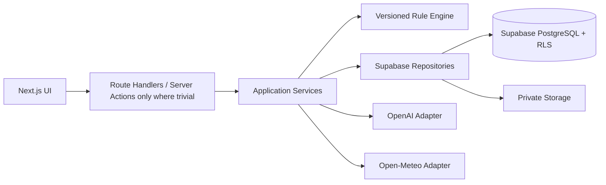

# Beauty OS v0.2 Development Specification

> 文档类型：架构审查与开发准备规范  
> 版本：v0.2  
> 日期：2026-08-18  
> 适用范围：Beauty OS Version 1.0  
> 状态：待确认；确认后作为 Codex 开发的主依据  
> 本文不包含应用代码

## 0. 文档地位与结论

本文是对 [v0.1 技术设计](./BEAUTY_OS_TECHNICAL_DESIGN.md) 的收敛审查。对于 Version 1.0，本文与 v0.1 冲突时以本文为准；v0.1 中被标记为 FUTURE 的设计只作为背景，不构成实现授权。

Principal Engineer 审查结论：

- v0.1 的产品原则和模块化单体方向正确。
- v0.1 的主要问题不是技术错误，而是把未来完整系统过早映射成了首版实现。
- Version 1.0 应从 6 个逻辑 Agent 收敛为 3 类 AI 能力，从完整领域数据库收敛为 8 张业务表，从“资源 API 全覆盖”收敛为 11 个 Route Handler 文件。
- AI 不承担最终选择权。规则引擎决定可用性、产品选择和购买分数；AI 仅负责图片提取与解释。
- Version 1.0 的成功标准是“一个人可以每天稳定使用”，不是“架构已经覆盖未来所有形态”。

### 0.1 唯一主链路

```text
登录
  → 建立皮肤档案
  → 录入并确认已有产品
  → 今日皮肤记录 + 天气
  → 规则生成今日护肤方案
  → AI 解释方案
  → 记录使用反馈
  → 需要时分析候选新品
```

只要某项设计不能直接改善这条链路的可用性、正确性、安全性或可维护性，就不进入 Version 1.0。

---

## 1. 架构 Review

## 1.1 KEEP

以下设计必须保留。

1. **模块化单体**
   - 一个 Next.js 仓库、一个部署单元、一个数据库。
   - 领域逻辑与 UI 分离，但不拆微服务。

2. **“规则决定，AI 解释”**
   - 过期、避用、历史不良反应等 Hard Block 必须由确定性代码执行。
   - 今日方案只能从用户已有且可用的产品中选择。
   - AI 不得绕过 Rule Engine 增加产品或改变购买评分。

3. **标准化、可校验的 AI 输出**
   - 所有 AI 调用使用版本化 schema。
   - 解析失败最多修复一次，之后降级为手工录入或模板化说明。

4. **Supabase 的一体化基础设施**
   - PostgreSQL、Auth、Private Storage 放在同一 Supabase 项目。
   - 所有用户数据具有 `user_id`，所有表开启 RLS。

5. **私有图片与最小数据发送**
   - 产品/皮肤图片不得使用 public bucket。
   - 不把邮箱、精确地址等无关信息发给 AI。

6. **天气适配器边界**
   - Open-Meteo 封装在 integration 层。
   - 天气失败不阻塞今日方案。

7. **规则版本、Prompt 版本与 AI 成本记录**
   - 方案和购买分析要能回答“由哪个规则版本生成”。
   - 最低限度保存模型、token、延迟和状态，支持成本审计。

8. **移动优先和故障降级**
   - 核心流程适配手机拍照和单手操作。
   - OpenAI 不可用时，资产管理、皮肤记录和规则方案仍可工作。

9. **不做医疗诊断**
   - 皮肤照片只辅助信息录入或外观记录。
   - 高风险反馈触发保守提醒，不输出疾病名称或治疗方案。

## 1.2 SIMPLIFY

以下设计保留目标，但缩小实现。

1. **六个 Agent → 三类 AI Capability**
   - `Product Extraction`：从产品图片提取草稿。
   - `Routine Explanation`：解释规则引擎已经生成的方案。
   - `Purchase Explanation`：解释规则评分和已有替代。
   - Ingredient Intelligence、Skin Analysis、Weather Intelligence 不再是 Agent，分别变成普通规则/服务。

2. **Agent Orchestrator → 普通 Application Service**
   - 不建立通用 Agent 状态机。
   - 每个用户动作最多触发一条固定 AI 调用路径。

3. **完整产品模型 → 用户资产模型**
   - Version 1.0 不区分全球标准产品与用户持有实例。
   - `products` 每行就是用户拥有的一件资产；相同商品有两瓶时可建两行。

4. **成分关系库 → 产品内规范化数组 + 代码规则**
   - 保存原始 INCI、规范化成分名数组和标签。
   - 不创建 `ingredients`、`product_ingredients`、知识图谱关系表。
   - 首版安全/冲突知识以版本化 TypeScript 规则文件维护。

5. **Routine + Steps 关系表 → Routine JSON 快照**
   - `routines.steps` 用 JSONB 保存 AM/PM 步骤和选择理由。
   - 个人数据量下不需要为步骤单独建表。

6. **Usage History 多表 → 单表反馈**
   - `usage_feedback.product_feedback` 用 JSONB 保存产品级评价。
   - 暂不建设事件溯源或复杂反馈时间序列。

7. **API 全资源覆盖 → 核心任务 API**
   - 删除独立 Ingredient、Memory、AI run 用户 API。
   - 同一资源的 GET/POST/PATCH 合并在少数 Route Handler 文件中。

8. **图片上传工作流**
   - 先创建 draft product，按 `userId/productId/...` 路径上传，再把 path 写入产品。
   - 不创建独立 upload session 业务表；失败对象通过维护脚本清理。

9. **数据库访问层**
   - Version 1.0 不同时使用 Drizzle runtime 和 Supabase Data API。
   - 使用生成的 Supabase TypeScript 类型 + repository 封装即可。

10. **开发阶段**
    - 不按 v0.1 Phase 0–8 全量推进。
    - 采用 10 个可独立验收的纵向 Coding Step，每一步都保持项目可运行。

## 1.3 REMOVE

以下内容从 Version 1.0 设计中删除。

1. 多 Agent 自主协作、Agent 之间对话、递归调用和动态工具选择。
2. OpenAI Agents SDK、multi-agent API、file search、vector store、web search 和 embeddings。
3. 独立的 Product、Ingredient、Skin、Weather、Routine、Purchase 六服务部署。
4. Drizzle ORM runtime、双数据客户端和重复维护的 ORM schema。
5. `ingredients`、`product_ingredients`、`skin_conditions` 字典表、`user_skin_conditions`、`routine_steps`、`usage_history_products`、`ai_memories`、`ingredient_interactions`、`ingredient_goal_effects`、`product_relations`、`rule_definitions`、`upload_assets`。
6. 独立的标准全球产品库与自动产品去重合并。
7. 用户可见的 AI run 查询页面/API。
8. Redis、消息队列、后台 worker、事件总线、Kubernetes。
9. 自动定时生成每日方案；首版在用户打开今日页或点击生成时运行。
10. 社交登录、多因素认证、角色权限、组织/会员体系。
11. 自动抓取品牌网站、商品价格、销量、促销信息。
12. 首版 PWA 离线写入和复杂同步冲突解决。

## 1.4 FUTURE

以下设计有价值，但必须等到明确触发条件出现。

| 未来能力 | 触发条件 |
|---|---|
| 独立标准产品表和 owned instances | 同一标准产品被多个真实用户重复录入，或需要共享产品修正 |
| 规范化成分表/关系表 | 需要按成分进行大量跨产品查询，数组规则已难维护 |
| AI Memory | 连续使用反馈证明跨周期偏好确实能提升方案，并设计出用户可编辑机制 |
| pgvector / RAG | 已有大量非结构化知识，关键词/结构化规则召回明显不足 |
| 后台 job/queue | AI 或图片任务频繁超过 Web 请求时限，且同步降级不可接受 |
| 单独 Backend/AI worker | Next.js Route Handlers 的运行限制成为已测量瓶颈 |
| 机器学习排序 | 有足够高质量标签、离线评测集和可量化提升目标 |
| PWA 离线能力 | 实际使用证明弱网/离线是高频问题 |
| 多用户公共产品库 | 产品从个人工具进入小范围真实多用户测试后 |
| 高级报表 | 至少积累 30–60 天稳定反馈且用户确实需要趋势分析 |

---

## 2. v0.2 冻结技术方案

| 层 | 冻结选择 | 相对 v0.1 | 原因 |
|---|---|---|---|
| Frontend | Next.js App Router + React + TypeScript；Tailwind CSS；少量 shadcn/ui；React Hook Form + Zod | 保留 | 一套语言覆盖 UI、schema 和服务端；移动优先开发效率高 |
| Backend | Next.js Route Handlers + server-only application services，模块化单体 | 保留并收敛 | 不另建 FastAPI；Route Handler 只做鉴权、校验和调用 service |
| Database | Supabase PostgreSQL | 保留 | 关系数据、约束、RLS 和托管成本适合个人项目 |
| ORM | **Version 1.0 不使用完整 ORM**；运行时使用 typed `supabase-js`，类型由 Supabase CLI 生成；迁移使用 SQL | 修改 | 避免 Drizzle schema、SQL migration、Supabase 类型三份事实源；让 session JWT 自然通过 RLS |
| Authentication | Supabase Auth：Email OTP / Magic Link；可配置单邮箱 allowlist | 收敛 | 个人使用不需要密码找回、OAuth 和复杂身份流程 |
| Storage | Supabase Private Storage；一个 `product-images` bucket；皮肤图片暂不进入 V1 主流程 | 收敛 | 只实现产品图片即可满足必选范围，减少敏感数据处理 |
| AI Provider | OpenAI Responses API；默认 `gpt-5.6-luna`，模型名通过环境变量配置；Structured Outputs | 收敛 | 当前 Luna 面向成本敏感工作负载并支持图像输入和结构化输出；规则承担复杂判断 |
| Weather Provider | Open-Meteo Forecast API | 保留 | 所需温度、湿度、UV、降水等字段齐全；通过 adapter 可替换 |
| Deployment | Vercel（Next.js）+ Supabase 托管项目 | 保留 | Git Preview 和低运维成本适合个人开发 |

### 2.1 冻结后的运行边界



硬边界：

- React component 不访问 OpenAI、天气或数据库。
- Route Handler 不包含评分、冲突或产品选择逻辑。
- 普通请求使用带用户 session 的 Supabase server client，使 RLS 生效。
- service role key 不参与普通用户请求，只允许用于明确的后台维护或账户删除脚本。
- 浏览器不直接 CRUD 业务表；图片上传也先从服务端取得限定路径的 signed upload token。

### 2.2 最小 API 表面积

Version 1.0 只实现以下 Route Handler 文件：

| 文件 | 方法 | 用途 |
|---|---|---|
| `/api/v1/profile/route.ts` | GET, PUT | 获取/更新个人档案 |
| `/api/v1/products/route.ts` | GET, POST | 资产列表、创建 draft |
| `/api/v1/products/[id]/route.ts` | GET, PATCH, DELETE | 资产详情、确认、更新、软删除 |
| `/api/v1/products/[id]/images/route.ts` | POST, DELETE | 获取 signed upload、移除图片 |
| `/api/v1/products/[id]/analyze/route.ts` | POST | 产品图片 → 结构化草稿 |
| `/api/v1/checkins/route.ts` | GET, PUT | 今日皮肤记录和历史摘要 |
| `/api/v1/weather/route.ts` | GET | 读取缓存或获取当前天气 |
| `/api/v1/routines/today/route.ts` | GET, POST | 获取或生成今日方案 |
| `/api/v1/routines/[id]/feedback/route.ts` | POST | 使用反馈 |
| `/api/v1/purchase-analyses/route.ts` | GET, POST | 历史列表、创建购买分析 |
| `/api/v1/purchase-analyses/[id]/route.ts` | GET | 单次购买分析详情 |

这是 11 个文件、18 个以内的方法，不再为每个 AI 子能力建立公开 API。

### 2.3 AI 调用与成本控制

1. **产品录入**：只有用户点击“识别图片”时调用一次；识别结果必须确认。
2. **今日方案**：规则引擎先生成完整 JSON。输入 hash 未变化时直接返回当日缓存，不再次调用 AI。
3. **购买分析**：先本地计算相似度和评分，只调用一次 AI 生成解释。
4. **不调用 AI 的路径**：登录、资产 CRUD、档案、check-in、天气、反馈保存。
5. **模型**：一个默认低成本多模态模型；Version 1.0 不自动升级到昂贵模型。
6. **输出上限**：产品提取、方案解释、购买解释分别设置明确的最大输出 token，不允许无限制输出。
7. **上下文上限**：只发送当前动作必要的产品摘要；不发送完整历史或全量库存图片。
8. **图片**：客户端先压缩到满足识别的尺寸和质量；同一图片 hash 不重复识别。
9. **重试**：仅对瞬时错误或 schema 失败重试一次；不做 Agent 自循环。
10. **预算**：`ai_runs` 累计日/月 token 和估算成本；超过环境配置预算时停止非必要 AI 调用并使用降级结果。
11. **缓存**：AI 结果存业务表；页面刷新不重新生成。
12. **可替换性**：业务层依赖 `AiProvider` 接口，不依赖 OpenAI SDK 返回对象。

OpenAI Docs 显示当前 `gpt-5.6-luna` 面向成本敏感场景，并支持 Responses、Structured Outputs 和 image input；模型仍通过环境变量配置，避免未来型号变化侵入业务代码。

---

## 3. Beauty OS Version 1.0 范围

## 3.1 产品目标

一个真实可每天使用的个人 WebApp：用户能维护已有资产，记录今日肤况，获得只使用已有产品的护肤方案，并对想买的新品得到保守、可解释的判断。

## 3.2 必须交付的 11 项能力

### 1. 用户登录

- Email OTP/Magic Link。
- 可选 allowlist，只允许一个指定邮箱。
- 登录状态、登出和受保护页面。

验收：未登录不能访问任何个人数据；登录后刷新仍保持 session。

### 2. 我的美妆资产库

- 列表、分类筛选、搜索。
- 展示图片、品牌、名称、类别、开封/到期、余量和状态。
- 软删除或标记 finished/discarded。

验收：用户只能看到自己的产品，产品状态可编辑。

### 3. 产品录入

- 手工创建 draft。
- 必填：名称、类别；品牌可选。
- 可填写原始 INCI、开封日期、到期日、PAO、余量、功能/目标标签。

验收：完全不使用 AI 也能完成产品录入。

### 4. 产品图片上传

- 产品正面、背面/成分表最多 3 张。
- 私有 bucket、文件类型/大小限制、signed upload。
- 上传后可预览和删除。

验收：其他用户或未签名 URL 无法读取图片。

### 5. 产品信息确认

- AI 识别只更新 draft 建议，不直接确认。
- 展示字段级置信度和未识别字段。
- 用户确认后产品才成为 `active`，才能用于今日方案。

验收：低置信度或错误字段可以修改；未确认产品不进入规则引擎。

### 6. 我的皮肤档案

- 肤质、敏感度、护肤目标、已知过敏/避用项、最大步骤数、位置和时区。
- 明确免责声明。

验收：影响推荐的变更会使今日方案 input hash 改变。

### 7. 今日皮肤记录

- 干燥、出油、泛红、痘痘倾向、刺痛/敏感 0–4。
- 当日备注。
- 每日一条，可重复编辑。

验收：今日方案记录使用的 check-in 快照；没有 check-in 时给中性默认并降低置信度。

### 8. 天气获取

- 按档案位置获取温度、湿度、UV、降水概率。
- 小时级缓存，显示数据时间。
- 失败时使用最近缓存或“天气未知”标签。

验收：天气服务不可用时今日方案仍能生成。

### 9. 今日护肤方案生成

- 生成 AM/PM 护肤方案，不包含彩妆方案 Version 1.0。
- 只使用 `active`、未过期、余量大于 0 的已有产品。
- Rule Engine 决定步骤；AI 提供简洁解释。
- 展示不选某类产品的关键原因、风险提示和置信度。

验收：关闭 OpenAI 时仍返回模板化规则方案；不存在的产品绝不出现。

### 10. 使用反馈

- 完成/部分/跳过、总体评分、反应等级、备注。
- 可记录产品级喜欢/不适。
- 反馈影响下一次规则评分；不建立复杂 Memory。

验收：高反应等级的产品在后续方案中被 Hard Block 或显著降权。

### 11. AI 购买建议

- 输入候选产品的文字信息和可选图片。
- 与已有产品按类别、功能、目标、规范化成分做可解释相似度。
- 输出 `do_not_buy / wait / sample_first / consider_buy / insufficient_data`。
- 显示已有替代、缺口、重复、风险、分数和置信度。

验收：已有高相似且余量充足的产品时明确降分；信息不足时不输出伪精确结论。

## 3.3 Version 1.0 明确不实现

- 复杂 AI Memory 和聊天式长期记忆
- 自动知识图谱、自动成分关系生成
- 大规模/全球产品数据库
- 多 Agent 自主协作
- 机器学习、个性化训练、embedding、向量检索
- 彩妆每日方案（资产库可录入彩妆；自动彩妆方案放后续）
- 社区、社交、分享、广告、电商和购买链接
- 皮肤图片诊断
- 自动网页搜索、品牌资料抓取和价格比较
- 后台定时任务、推送通知和离线同步

---

## 4. Database v1

## 4.1 设计原则

- Supabase `auth.users` 是认证事实源，不复制邮箱、密码或身份状态。
- 仅 8 张业务表。
- UUID 主键；时间用 `timestamptz`，业务日期用 `date`。
- 所有用户数据表带 `user_id` 并启用 RLS。
- 核心可查询字段使用普通列；低查询频率的快照和 AI 解释使用 JSONB。
- 不使用 PostgreSQL enum；Version 1.0 使用 `text + CHECK`，减少 enum migration 成本。
- `updated_at` 由应用写入，不为首版建设通用 trigger 框架。
- 删除产品默认软删除，保留 Routine 和反馈快照的历史含义。

## 4.2 Table 1：`profiles`

### 字段

| 字段 | 类型 | 约束/说明 |
|---|---|---|
| `user_id` | uuid | PK；FK → `auth.users.id`；ON DELETE CASCADE |
| `display_name` | text | nullable |
| `timezone` | text | NOT NULL，默认 `Asia/Shanghai` |
| `locale` | text | NOT NULL，默认 `zh-CN` |
| `location_name` | text | nullable |
| `latitude` | numeric(8,5) | nullable，-90..90 |
| `longitude` | numeric(8,5) | nullable，-180..180 |
| `skin_type` | text | nullable；dry/oily/combination/normal/unknown |
| `sensitivity_level` | smallint | NOT NULL 默认 0；0..4 |
| `goals` | text[] | NOT NULL 默认空数组 |
| `allergies` | text[] | NOT NULL 默认空数组 |
| `avoid_ingredients` | text[] | NOT NULL 默认空数组；规范化名称 |
| `max_am_steps` | smallint | NOT NULL 默认 4；1..8 |
| `max_pm_steps` | smallint | NOT NULL 默认 5；1..8 |
| `preferences` | jsonb | NOT NULL 默认 `{}`；质地/简洁度等非核心偏好 |
| `onboarding_completed_at` | timestamptz | nullable |
| `created_at` | timestamptz | NOT NULL 默认 now() |
| `updated_at` | timestamptz | NOT NULL 默认 now() |

### 关系

- 一对一关联 `auth.users`。
- 一对多关联其余 7 张业务表。

### 索引

- 主键索引：`profiles(user_id)`。
- 无位置索引；个人版不做地理搜索。

### 为什么需要

保存登录身份之外的个人设置、皮肤档案、推荐约束和天气位置。将基础 profile 与 beauty profile 合并，避免首版一对一双表。

## 4.3 Table 2：`products`

每行代表用户实际拥有的一件产品，不是公共商品目录。

### 字段

| 字段 | 类型 | 约束/说明 |
|---|---|---|
| `id` | uuid | PK，默认 `gen_random_uuid()` |
| `user_id` | uuid | NOT NULL；FK → `profiles.user_id`；ON DELETE CASCADE |
| `brand_name` | text | nullable |
| `product_name` | text | NOT NULL |
| `normalized_name` | text | NOT NULL；搜索/查重用 |
| `category` | text | NOT NULL；Version 1.0 固定 code 列表 |
| `status` | text | NOT NULL；draft/active/paused/finished/discarded |
| `source` | text | NOT NULL；manual/image |
| `size_value` | numeric(10,2) | nullable |
| `size_unit` | text | nullable |
| `opened_at` | date | nullable |
| `expires_at` | date | nullable |
| `pao_months` | smallint | nullable，1..60 |
| `quantity_percent` | smallint | NOT NULL 默认 100；0..100 |
| `ingredients_raw` | text | nullable；包装原文 |
| `normalized_ingredients` | text[] | NOT NULL 默认空数组 |
| `function_tags` | text[] | NOT NULL 默认空数组 |
| `target_tags` | text[] | NOT NULL 默认空数组 |
| `attributes` | jsonb | NOT NULL 默认 `{}`；SPF、质地、彩妆色号等 |
| `image_paths` | text[] | NOT NULL 默认空数组；最多 3 个私有对象路径 |
| `ai_analysis` | jsonb | nullable；字段建议、置信度、模型和 prompt version |
| `notes` | text | nullable |
| `created_at` | timestamptz | NOT NULL 默认 now() |
| `updated_at` | timestamptz | NOT NULL 默认 now() |
| `deleted_at` | timestamptz | nullable；软删除 |

### 关系

- 多对一关联 `profiles`。
- 被 `routines.steps`、`usage_feedback.product_feedback` 和 `purchase_analyses` JSON 快照引用；这些是历史快照，不设 JSON 外键。

### 索引

- `products(user_id, status)`：资产列表和规则候选。
- `products(user_id, category)`：分类筛选与相似产品查找。
- `products(user_id, updated_at desc)`：最近编辑。
- 部分索引 `products(user_id) WHERE deleted_at IS NULL`。
- Version 1.0 不建 GIN 数组索引；个人库存规模下顺序扫描足够。

### 为什么需要

承载“我的美妆资产库”、draft 确认、到期状态、余量、图片和规则需要的成分/标签。合并标准产品与 owned product 可显著减少表、联表和确认流程复杂度。

## 4.4 Table 3：`skin_checkins`

### 字段

| 字段 | 类型 | 约束/说明 |
|---|---|---|
| `id` | uuid | PK |
| `user_id` | uuid | NOT NULL；FK → `profiles.user_id`；ON DELETE CASCADE |
| `checkin_date` | date | NOT NULL；用户本地日期 |
| `dryness` | smallint | NOT NULL 默认 0；0..4 |
| `oiliness` | smallint | NOT NULL 默认 0；0..4 |
| `redness` | smallint | NOT NULL 默认 0；0..4 |
| `breakout_level` | smallint | NOT NULL 默认 0；0..4 |
| `sensitivity` | smallint | NOT NULL 默认 0；0..4 |
| `notes` | text | nullable |
| `created_at` | timestamptz | NOT NULL 默认 now() |
| `updated_at` | timestamptz | NOT NULL 默认 now() |

### 关系

- 多对一关联 `profiles`。
- 生成方案时复制为 `routines.skin_snapshot`，避免后续编辑改变历史依据。

### 索引

- UNIQUE `skin_checkins(user_id, checkin_date)`：每日一条，PUT 为 upsert。
- `skin_checkins(user_id, checkin_date desc)`：近期趋势和规则读取。

### 为什么需要

提供今天与最近几天的主观肤况；主观记录比皮肤图片更可靠、更低成本，也更符合非医疗边界。

## 4.5 Table 4：`weather_cache`

### 字段

| 字段 | 类型 | 约束/说明 |
|---|---|---|
| `id` | uuid | PK |
| `user_id` | uuid | NOT NULL；FK → `profiles.user_id`；ON DELETE CASCADE |
| `location_key` | text | NOT NULL；由舍入坐标生成，不含完整地址 |
| `observed_hour` | timestamptz | NOT NULL；小时取整 |
| `temperature_c` | numeric(5,2) | nullable |
| `relative_humidity` | numeric(5,2) | nullable，0..100 |
| `uv_index` | numeric(5,2) | nullable |
| `precipitation_probability` | numeric(5,2) | nullable，0..100 |
| `weather_code` | text | nullable |
| `source` | text | NOT NULL 默认 `open_meteo` |
| `fetched_at` | timestamptz | NOT NULL 默认 now() |

### 关系

- 多对一关联 `profiles`。
- 生成方案时复制为 `routines.weather_snapshot`。

### 索引

- UNIQUE `weather_cache(user_id, location_key, observed_hour, source)`。
- `weather_cache(user_id, fetched_at desc)`：快速取得最近可用缓存。

### 为什么需要

避免每次打开页面都请求天气服务，并为故障降级提供最近数据。只保存实际使用字段，不长期保留第三方完整 payload。

## 4.6 Table 5：`routines`

### 字段

| 字段 | 类型 | 约束/说明 |
|---|---|---|
| `id` | uuid | PK |
| `user_id` | uuid | NOT NULL；FK → `profiles.user_id`；ON DELETE CASCADE |
| `routine_date` | date | NOT NULL；用户本地日期 |
| `status` | text | NOT NULL；generated/accepted/completed/skipped/superseded |
| `input_hash` | text | NOT NULL；档案、库存、check-in、天气和规则版本摘要 hash |
| `profile_snapshot` | jsonb | NOT NULL |
| `skin_snapshot` | jsonb | NOT NULL |
| `weather_snapshot` | jsonb | NOT NULL |
| `steps` | jsonb | NOT NULL；`{am: [...], pm: [...]}`，每步含 productId/name/role/reasons/score |
| `warnings` | jsonb | NOT NULL 默认 `[]` |
| `score_breakdown` | jsonb | NOT NULL |
| `summary` | text | NOT NULL；AI 失败时为模板文案 |
| `confidence` | numeric(4,3) | NOT NULL；0..1 |
| `rule_version` | text | NOT NULL |
| `prompt_version` | text | nullable；未调用 AI 时为空 |
| `model` | text | nullable |
| `generated_at` | timestamptz | NOT NULL 默认 now() |
| `superseded_at` | timestamptz | nullable |

### 关系

- 多对一关联 `profiles`。
- 一对多关联 `usage_feedback`。
- `steps` 内引用产品 ID，但同时保存产品名称与关键属性快照。

### 索引

- `routines(user_id, routine_date, generated_at desc)`：今日方案。
- UNIQUE `routines(user_id, routine_date, input_hash)`：相同输入幂等。
- `routines(user_id, status)`：查找 active/已完成方案。

### 为什么需要

保存可复现的每日方案及证据。步骤采用 JSONB 是有意的 Version 1.0 简化：写入和读取始终作为整体，不需要复杂步骤查询。

## 4.7 Table 6：`usage_feedback`

### 字段

| 字段 | 类型 | 约束/说明 |
|---|---|---|
| `id` | uuid | PK |
| `user_id` | uuid | NOT NULL；FK → `profiles.user_id`；ON DELETE CASCADE |
| `routine_id` | uuid | NOT NULL；FK → `routines.id`；ON DELETE CASCADE |
| `completion` | text | NOT NULL；completed/partial/skipped |
| `overall_rating` | smallint | nullable；1..5 |
| `reaction_level` | smallint | NOT NULL 默认 0；0..4 |
| `reaction_tags` | text[] | NOT NULL 默认空数组 |
| `product_feedback` | jsonb | NOT NULL 默认 `[]`；productId/rating/reaction/notes |
| `notes` | text | nullable |
| `used_at` | timestamptz | NOT NULL 默认 now() |
| `created_at` | timestamptz | NOT NULL 默认 now() |

### 关系

- 多对一关联 `profiles`。
- 多对一关联 `routines`。

### 索引

- `usage_feedback(user_id, used_at desc)`：最近反馈。
- `usage_feedback(user_id, reaction_level, used_at desc)`：Hard Block 检索。
- Version 1.0 每个方案允许多次反馈；若产品使用只记录一次，可由 service 更新已有当日记录。

### 为什么需要

将“方案是否执行”和“使用后的反应”反馈给规则引擎。JSONB 产品反馈避免再建关联表，同时保留必要的产品级信号。

## 4.8 Table 7：`purchase_analyses`

### 字段

| 字段 | 类型 | 约束/说明 |
|---|---|---|
| `id` | uuid | PK |
| `user_id` | uuid | NOT NULL；FK → `profiles.user_id`；ON DELETE CASCADE |
| `candidate_snapshot` | jsonb | NOT NULL；候选名称、类别、成分、标签、价格（可选） |
| `inventory_snapshot` | jsonb | NOT NULL；当时已有替代摘要 |
| `score_breakdown` | jsonb | NOT NULL；gap/fit/uniqueness/penalties |
| `final_score` | numeric(5,2) | nullable；信息不足时允许为空 |
| `decision` | text | NOT NULL；do_not_buy/wait/sample_first/consider_buy/insufficient_data |
| `alternatives` | jsonb | NOT NULL 默认 `[]`；最多 3 个已有替代 |
| `missing_data` | text[] | NOT NULL 默认空数组 |
| `confidence` | numeric(4,3) | NOT NULL；0..1 |
| `explanation` | text | NOT NULL；AI 失败时为模板文案 |
| `rule_version` | text | NOT NULL |
| `prompt_version` | text | nullable |
| `model` | text | nullable |
| `created_at` | timestamptz | NOT NULL 默认 now() |

### 关系

- 多对一关联 `profiles`。
- 通过 JSON 快照引用分析时的产品，不依赖产品后续是否删除或修改。

### 索引

- `purchase_analyses(user_id, created_at desc)`：历史列表。
- `purchase_analyses(user_id, decision)`：个人决策回顾，可选但成本很低。

### 为什么需要

购买建议是产品核心之一，需要保存当时库存、规则分数和解释，否则无法复盘“为什么当时建议不买”。

## 4.9 Table 8：`ai_runs`

### 字段

| 字段 | 类型 | 约束/说明 |
|---|---|---|
| `id` | uuid | PK |
| `user_id` | uuid | NOT NULL；FK → `profiles.user_id`；ON DELETE CASCADE |
| `purpose` | text | NOT NULL；product_extraction/routine_explanation/purchase_explanation |
| `business_id` | uuid | nullable；关联 product/routine/purchase analysis，非多态外键 |
| `request_hash` | text | NOT NULL；用于去重和排查 |
| `model` | text | NOT NULL |
| `prompt_version` | text | NOT NULL |
| `status` | text | NOT NULL；succeeded/failed/degraded |
| `input_tokens` | integer | nullable |
| `output_tokens` | integer | nullable |
| `estimated_cost_usd` | numeric(12,6) | nullable；基于配置价格估算，不作为账单事实 |
| `latency_ms` | integer | nullable |
| `error_code` | text | nullable；不保存敏感错误原文 |
| `created_at` | timestamptz | NOT NULL 默认 now() |

### 关系

- 多对一关联 `profiles`。
- `business_id` 只用于追踪，不做跨多表外键。

### 索引

- `ai_runs(user_id, created_at desc)`：日/月用量汇总。
- `ai_runs(user_id, purpose, request_hash)`：重复请求检测。
- `ai_runs(status, created_at desc)`：失败监控。

### 为什么需要

这是成本控制和 AI 故障排查的最低可用审计表。默认不保存完整 prompt、图片或模型原始响应，避免重复敏感数据。

## 4.10 RLS 与 Storage 规则

每张业务表的基础策略：

- SELECT/INSERT/UPDATE/DELETE 均要求 `auth.uid() = user_id`。
- `profiles` INSERT/UPDATE 只能操作 `user_id = auth.uid()`。
- 子资源更新除自身 `user_id` 外，repository 还要验证父资源属于当前用户。
- 普通请求禁止使用 service role client。

Storage：

- Bucket：`product-images`，private。
- 对象路径：`{user_id}/{product_id}/{uuid}.{ext}`。
- policy 要求路径第一段等于 `auth.uid()`。
- service 先验证 product 所属，再签发 upload token。
- 删除产品时尝试删除对象；失败可留下孤儿，后续维护脚本清理，不阻塞产品软删除。

## 4.11 SQL migration 文件规划

目录固定为 `supabase/migrations/`；文件只追加，不修改已经在共享环境应用过的 migration。

| 顺序 | 文件名 | 内容 | 随哪个 Coding Step |
|---|---|---|---|
| 1 | `YYYYMMDDHHMMSS_create_profiles.sql` | `profiles`、check constraints、RLS policies | Step 2 |
| 2 | `YYYYMMDDHHMMSS_create_products.sql` | `products`、索引、RLS；创建 private bucket 与基础 storage policy | Step 4 |
| 3 | `YYYYMMDDHHMMSS_create_skin_checkins.sql` | `skin_checkins`、唯一约束、RLS | Step 6 |
| 4 | `YYYYMMDDHHMMSS_create_weather_cache.sql` | `weather_cache`、索引、RLS | Step 6 |
| 5 | `YYYYMMDDHHMMSS_create_routines.sql` | `routines`、幂等约束、RLS | Step 7 |
| 6 | `YYYYMMDDHHMMSS_create_usage_feedback.sql` | `usage_feedback`、索引、RLS | Step 8 |
| 7 | `YYYYMMDDHHMMSS_create_purchase_analyses.sql` | `purchase_analyses`、索引、RLS | Step 9 |
| 8 | `YYYYMMDDHHMMSS_create_ai_runs.sql` | `ai_runs`、成本/状态索引、RLS | Step 5 或 9 前 |

迁移流程：

1. 在本地 Supabase 重建数据库并应用全部 migration。
2. 运行数据库约束/RLS 自动测试。
3. 重新生成 `src/db/database.types.ts`。
4. 检查类型 diff 后再提交。
5. 先应用 staging/preview，验证后再应用 production。

禁止：从 Dashboard 手工修改生产表后不补 migration；把 seed 用户数据写入生产 migration；回改已发布 migration。

---

## 5. Coding Roadmap

每一步都是可独立提交和回滚理解的纵向增量。完成标准未满足时，不进入下一步。

## Step 1：初始化可运行项目

### 目标

建立最小 Next.js 应用、代码质量工具和环境变量契约。

### 修改文件

- `package.json`
- `next.config.ts`
- `tsconfig.json`
- `eslint.config.mjs`
- `.env.example`
- `src/app/layout.tsx`
- `src/app/page.tsx`
- `src/app/globals.css`
- `src/env.ts`
- `README.md`

### 完成标准

- `npm run dev` 可启动。
- `/` 显示 Beauty OS 基础页面。
- `npm run lint`、`npm run typecheck`、`npm run build` 成功。
- 缺失必需环境变量时有明确错误，不泄露值。

### 测试方式

- 本地执行 dev/lint/typecheck/build。
- 浏览器检查桌面和手机宽度。

## Step 2：Supabase、认证与 RLS 基础

### 目标

打通 Email OTP/Magic Link、session、受保护布局和 `profiles`。

### 修改文件

- `supabase/config.toml`
- `supabase/migrations/*_create_profiles.sql`
- `src/db/database.types.ts`
- `src/lib/supabase/client.ts`
- `src/lib/supabase/server.ts`
- `src/lib/supabase/middleware.ts`
- `src/app/(auth)/login/page.tsx`
- `src/app/auth/callback/route.ts`
- `src/app/(app)/layout.tsx`
- `src/server/auth/get-current-user.ts`
- `tests/integration/rls/profiles.test.ts`

### 完成标准

- 登录、回调、登出、刷新 session 正常。
- 未登录访问 app 页面会跳转登录。
- 用户只能读写自己的 profile。
- allowlist 开启时其他邮箱不能进入 app。

### 测试方式

- Auth 冒烟测试。
- 使用两个测试用户执行 RLS 交叉访问测试。
- 全量 lint/typecheck/build。

## Step 3：我的皮肤档案

### 目标

完成 onboarding 与皮肤档案编辑，为后续规则提供稳定输入。

### 修改文件

- `src/schemas/profile.ts`
- `src/server/repositories/profile-repository.ts`
- `src/server/services/profile-service.ts`
- `src/app/api/v1/profile/route.ts`
- `src/features/profile/profile-form.tsx`
- `src/app/(app)/profile/page.tsx`
- `tests/unit/schemas/profile.test.ts`
- `tests/integration/api/profile.test.ts`

### 完成标准

- 用户可填写肤质、敏感度、目标、避用项、步骤数、位置和时区。
- GET/PUT 均经过同一 Zod schema。
- 非法坐标、等级或步骤数被拒绝。

### 测试方式

- schema 边界值单元测试。
- API 未登录、合法、非法、跨用户测试。
- 手工完成 onboarding。

## Step 4：资产库与手工产品录入

### 目标

在完全没有 AI 的前提下完成产品 CRUD、确认和状态管理。

### 修改文件

- `supabase/migrations/*_create_products.sql`
- `src/db/database.types.ts`
- `src/schemas/product.ts`
- `src/server/repositories/product-repository.ts`
- `src/server/services/product-service.ts`
- `src/app/api/v1/products/route.ts`
- `src/app/api/v1/products/[id]/route.ts`
- `src/app/(app)/inventory/page.tsx`
- `src/app/(app)/inventory/new/page.tsx`
- `src/app/(app)/inventory/[id]/page.tsx`
- `src/features/inventory/*`
- `tests/unit/products/*`
- `tests/integration/api/products.test.ts`

### 完成标准

- 创建 draft、编辑、确认 active、暂停、完成和软删除可用。
- 列表支持搜索和分类筛选。
- 过期/PAO 状态有统一计算函数。
- 两个用户之间无法读取或修改对方产品。

### 测试方式

- 产品 schema 和 expiry 计算单元测试。
- CRUD/RLS 集成测试。
- 浏览器完成“新建 → 确认 → 修改余量 → 归档”。

## Step 5：产品图片与 AI 信息确认

### 目标

完成私有图片上传、产品识别和人工确认闭环。

### 修改文件

- `src/schemas/product-analysis.ts`
- `src/server/integrations/storage/product-images.ts`
- `src/server/ai/provider.ts`
- `src/server/ai/openai-provider.ts`
- `src/server/ai/prompts/product-extraction.v1.ts`
- `src/server/services/product-analysis-service.ts`
- `src/app/api/v1/products/[id]/images/route.ts`
- `src/app/api/v1/products/[id]/analyze/route.ts`
- `src/features/inventory/image-uploader.tsx`
- `src/features/inventory/product-confirmation-form.tsx`
- `supabase/migrations/*_create_ai_runs.sql`
- `tests/fixtures/ai/product-extraction/*`
- `tests/unit/ai/product-extraction.test.ts`

### 完成标准

- 最多上传 3 张受限图片并私有预览。
- AI 返回结构化草稿和字段置信度。
- AI 结果不会自动把 draft 变成 active。
- AI 不可用时可继续手工确认。
- 每次 AI 调用记录 token/状态/延迟。

### 测试方式

- Storage policy 测试：匿名/其他用户访问失败。
- 使用固定 AI fixture 测 schema 与确认流程，不在常规测试中调用真实 API。
- 手工进行一次真实图片识别 smoke test。

## Step 6：今日皮肤记录与天气

### 目标

为每日方案提供可缓存、可降级的上下文。

### 修改文件

- `supabase/migrations/*_create_skin_checkins.sql`
- `supabase/migrations/*_create_weather_cache.sql`
- `src/db/database.types.ts`
- `src/schemas/checkin.ts`
- `src/server/repositories/checkin-repository.ts`
- `src/server/repositories/weather-repository.ts`
- `src/server/integrations/weather/provider.ts`
- `src/server/integrations/weather/open-meteo.ts`
- `src/server/services/weather-service.ts`
- `src/app/api/v1/checkins/route.ts`
- `src/app/api/v1/weather/route.ts`
- `src/app/(app)/check-in/page.tsx`
- `tests/unit/weather/*`
- `tests/integration/api/checkins-weather.test.ts`

### 完成标准

- 今日 check-in 可创建和编辑。
- 天气首次获取后进入小时缓存。
- 远端失败时返回最近缓存或 unknown context。
- UI 显示天气数据时间与降级状态。

### 测试方式

- mock Open-Meteo 的成功、超时和无数据响应。
- 时区日期边界测试。
- check-in 每日唯一与 RLS 测试。

## Step 7：Rule Engine 与今日护肤方案

### 目标

在不依赖 AI 的前提下生成安全、可解释、只使用已有产品的 AM/PM 方案；随后添加 AI 简洁解释。

### 修改文件

- `supabase/migrations/*_create_routines.sql`
- `src/db/database.types.ts`
- `src/server/rules/catalog.v1.ts`
- `src/server/rules/eligibility.ts`
- `src/server/rules/product-score.ts`
- `src/server/rules/assemble-routine.ts`
- `src/server/rules/rule-version.ts`
- `src/schemas/routine.ts`
- `src/server/repositories/routine-repository.ts`
- `src/server/services/generate-today-routine.ts`
- `src/server/ai/prompts/routine-explanation.v1.ts`
- `src/app/api/v1/routines/today/route.ts`
- `src/app/(app)/today/page.tsx`
- `src/features/routine/*`
- `tests/unit/rules/*`
- `tests/integration/api/today-routine.test.ts`

### 完成标准

- Hard Block、评分、步骤上限和组合顺序通过固定测试集。
- 同一 input hash 重复请求不重复生成或调用 AI。
- AI 失败时返回完整模板方案。
- 每个步骤都能展示 reason codes。

### 测试方式

- 至少覆盖：过期、余量 0、未确认、避用、近期高反应、高 UV、天气缺失、最大步骤数。
- 用 spy 断言缓存命中时 AI 未调用。
- E2E 完成“check-in → 生成 → 查看理由”。

## Step 8：使用反馈闭环

### 目标

记录方案执行和反应，并让反馈进入下一次规则计算。

### 修改文件

- `supabase/migrations/*_create_usage_feedback.sql`
- `src/db/database.types.ts`
- `src/schemas/usage-feedback.ts`
- `src/server/repositories/feedback-repository.ts`
- `src/server/services/record-feedback.ts`
- `src/server/rules/history-adjustment.ts`
- `src/app/api/v1/routines/[id]/feedback/route.ts`
- `src/features/routine/feedback-form.tsx`
- `tests/unit/rules/history-adjustment.test.ts`
- `tests/integration/api/feedback.test.ts`

### 完成标准

- 可记录完成度、总评分、反应和产品反馈。
- 高反应产品在新方案中被阻止或显著降权。
- 反馈接口验证 routine 属于当前用户。

### 测试方式

- 反馈 schema 与跨用户测试。
- 固定历史输入的评分前后对比测试。
- E2E 完成“生成 → 反馈 → 次日方案变化”。

## Step 9：AI 购买建议

### 目标

完成候选新品分析、已有替代、可复算评分和保守解释。

### 修改文件

- `supabase/migrations/*_create_purchase_analyses.sql`
- `src/db/database.types.ts`
- `src/schemas/purchase-analysis.ts`
- `src/server/rules/product-similarity.ts`
- `src/server/rules/purchase-score.ts`
- `src/server/repositories/purchase-analysis-repository.ts`
- `src/server/services/analyze-purchase.ts`
- `src/server/ai/prompts/purchase-explanation.v1.ts`
- `src/app/api/v1/purchase-analyses/route.ts`
- `src/app/api/v1/purchase-analyses/[id]/route.ts`
- `src/app/(app)/purchase-advisor/page.tsx`
- `src/features/purchase/*`
- `tests/unit/rules/product-similarity.test.ts`
- `tests/unit/rules/purchase-score.test.ts`
- `tests/integration/api/purchase-analyses.test.ts`

### 完成标准

- 相似度与购买分可由测试数据手算复现。
- 展示最多 3 个已有替代。
- 关键数据不足时返回 `insufficient_data`。
- AI 只能解释规则输出，不能更改 decision/final score。

### 测试方式

- 重复产品、真实缺口、避用成分、无价格、成分缺失测试。
- 将 AI mock 为矛盾输出，验证后校验仍保持规则 decision。
- E2E 完成一次购买分析。

## Step 10：发布准备与可靠性

### 目标

完成 Version 1.0 的生产安全、移动体验、监控和部署验收。

### 修改文件

- `src/server/observability/*`
- `src/app/error.tsx`
- `src/app/not-found.tsx`
- `tests/e2e/*`
- `docs/runbook.md`
- `docs/privacy-and-retention.md`
- `README.md`
- Vercel/Supabase 环境配置（不提交密钥）

### 完成标准

- lint/typecheck/unit/integration/E2E/build 全部通过。
- Preview 与 Production 使用不同项目/密钥。
- AI/天气失败均有可验证降级。
- 手机尺寸核心流程可用。
- 生产 migration、备份和回滚 runbook 已演练。

### 测试方式

- 完整 smoke test：登录 → 档案 → 录产品 → 图片识别 → check-in → 天气 → 方案 → 反馈 → 购买分析。
- 两用户隔离测试。
- 故障注入：OpenAI 失败、天气超时、Storage 拒绝、非法 API 输入。

---

## 6. Git Commit 规划

前 3 个 commit 都必须使主分支保持可运行；提交前统一执行 `lint + typecheck + test（已有时）+ build`。

## 第一次 commit

```text
chore: initialize Beauty OS web app
```

包含：

- Next.js + TypeScript 初始化。
- Tailwind、基础页面、环境变量校验。
- lint、typecheck、build scripts。
- README 与 `.env.example`。

提交条件：

- 不包含 Supabase/AI 业务代码。
- `npm run dev` 可打开首页。
- lint、typecheck、build 全部成功。

## 第二次 commit

```text
feat(auth): add Supabase login and protected profile foundation
```

包含：

- Supabase client/server session 基础。
- Email OTP/Magic Link 登录、回调、登出、受保护布局。
- 第一条 `profiles` migration、RLS 和生成的数据库类型。
- 最小 profile repository/service 和 RLS 测试。

提交条件：

- 新用户登录后能获得自己的 profile。
- 未登录不可进入受保护页面。
- 两个测试用户不能交叉读写。
- 项目仍可 build 和部署。

## 第三次 commit

```text
feat(inventory): add manual beauty product management
```

包含：

- `products` migration、RLS、类型更新。
- 产品 schema、repository、service、API。
- 资产列表、创建、编辑、确认和软删除。
- expiry/PAO 单元测试和 CRUD 集成测试。

提交条件：

- 不依赖 OpenAI 即可完成资产录入闭环。
- 每个 API 有鉴权和 validation。
- 跨用户访问失败。
- dev/lint/typecheck/test/build 全部成功。

之后继续遵守“一次提交一个可验证纵向能力”，不把图片、天气、规则、反馈和购买分析塞进同一大提交。

---

## 7. AI Coding Rules

以下规则对后续 Codex 和人工开发同样生效。

## 7.1 架构规则

1. 不允许把业务逻辑写进 React component。
2. Route Handler 只负责鉴权、validation、调用 service 和映射 HTTP 响应。
3. Rule Engine 必须是无网络、可单元测试的纯逻辑。
4. Repository 只做数据访问，不计算推荐分数。
5. Integration adapter 不泄漏第三方 SDK 类型到 application/domain 层。
6. 不允许为了未来扩展提前引入微服务、队列、事件总线、向量库或通用 Agent 框架。
7. 新抽象至少要有两个真实调用点，或解决一个已出现的测试/维护问题。

## 7.2 Schema 与数据库规则

8. 所有功能先定义输入/输出 schema，再写 UI 和 service。
9. 所有 API 输入必须经 Zod validation；不得直接信任 `request.json()`。
10. 不允许直接修改生产数据库结构。
11. 所有结构变更必须使用新的、前向 SQL migration。
12. 不允许修改已经在共享环境应用过的 migration。
13. 每次 migration 后必须重新生成并审查 Supabase TypeScript 类型。
14. 每张用户表必须有 `user_id`、RLS policy 和跨用户自动测试。
15. 普通请求禁止使用 service role client。
16. 所有 repository 方法必须显式接收当前 `userId` 或带 session 的 client。
17. JSONB 只用于整体读写的快照/可变属性；需要筛选、排序或约束的字段必须建普通列。
18. 删除历史关联数据前必须确认是否破坏 Routine/反馈/购买分析的可解释性；产品默认软删除。

## 7.3 AI 规则

19. 所有 AI 输出必须结构化并通过本地 schema 校验。
20. AI 不能决定 Hard Block、最终产品选择、购买分数或 decision。
21. AI 识别结果未经用户确认不得把产品标记为 active。
22. AI 不得推荐用户未拥有的产品进入今日方案。
23. 每个用户动作最多一次主 AI 调用；禁止递归、自主协作和无上限重试。
24. 模型名、最大 token、超时和预算必须来自集中配置，不得散落硬编码。
25. AI 请求只发送完成任务需要的最小字段，不发送邮箱、精确位置和无关历史。
26. 默认不在 `ai_runs` 保存完整 prompt、图片或原始响应。
27. 所有 AI 路径必须有不依赖 AI 的降级结果。
28. 修改 prompt 或输出 schema 必须递增 `prompt_version` 并更新 fixtures/tests。
29. 常规自动测试使用 fixtures/mock，不调用真实付费 API。

## 7.4 安全与隐私规则

30. Supabase service role、OpenAI key 和其他 secret 不得进入客户端、日志、测试 fixture 或 Git。
31. Storage bucket 必须 private；UI 只使用短期 signed URL。
32. 上传必须校验所有权、MIME、大小和数量；不能只相信扩展名。
33. 不记录 session token、Magic Link、精确坐标或图片二进制到日志。
34. 用户错误响应不返回数据库、第三方或堆栈内部信息。
35. 皮肤相关文案不得诊断疾病；风险情况使用保守提醒和专业就医建议。

## 7.5 质量规则

36. 每个新规则必须至少有一个正例、一个反例和一个边界测试。
37. 每个 bug fix 先增加能复现问题的测试，再修改实现。
38. 每个 API 至少测试：未登录、合法输入、非法输入、资源不存在、跨用户访问。
39. 每个 Coding Step 结束必须通过 lint、typecheck、相关测试和 production build。
40. 不允许用 `any` 绕过 AI、数据库或 API 边界类型；未知数据先用 `unknown` 再解析。
41. 不允许静默吞掉错误；应转换为稳定 error code 并记录 request ID。
42. 不新增依赖来解决少量可直接实现的问题；新增依赖必须说明用途和替代方案。
43. 修改范围保持与当前 Step 一致；不得顺手实现 FUTURE 功能。
44. 工作区已有修改视为用户资产，不覆盖、不重置、不顺带格式化无关文件。

## 7.6 产品原则

45. 今日方案优先最大化已有产品价值，不以增加步骤为目标。
46. 没有合适产品时明确显示“缺口”，不自动生成具体购买推荐。
47. 购买分析的高分表示“当前购买合理性”，不是产品质量或流行度。
48. 销量、折扣、佣金、广告和品牌合作不得进入评分。
49. 信息不足时输出 `insufficient_data`，不得用模型推测补齐。
50. 可解释性优先于算法复杂度；用户应能理解每个主要加分、扣分和排除原因。

---

## 8. Definition of Done：Beauty OS Version 1.0

只有同时满足以下条件，Version 1.0 才算完成：

- 11 项必需能力全部通过验收。
- 一个真实用户连续使用 7 天不需要开发者手工修数据库。
- 所有今日方案只包含已确认、可用、未过期的用户已有产品。
- OpenAI 与天气服务分别故障时，核心页面仍可使用并明确显示降级。
- 购买评分可由保存的 score breakdown 复算。
- RLS 两用户隔离测试覆盖全部业务表。
- 所有 AI 输出通过 schema，所有 AI 路径有 mock 测试和降级测试。
- Preview 和 Production 环境隔离，生产没有客户端 secret。
- 全量 lint、typecheck、unit、integration、E2E 和 build 成功。
- 本文列为 REMOVE/FUTURE 的功能没有被提前实现。

---

## 9. 冻结决策摘要

```text
Architecture:  Modular Monolith
Frontend:      Next.js App Router + TypeScript
Backend:       Next.js Route Handlers + Application Services
Database:      Supabase PostgreSQL
ORM:           None in V1; typed supabase-js + SQL migrations
Auth:          Supabase Email OTP / Magic Link
Storage:       Supabase Private Storage, product-images only
AI:            OpenAI Responses API + Structured Outputs
Default Model: gpt-5.6-luna via environment configuration
Weather:       Open-Meteo
Deployment:    Vercel + Supabase
AI Pattern:    3 fixed capabilities, no autonomous agents
Decision Core: Versioned Rule Engine
Business Tables: 8
```

开发开始前，不再需要讨论未来平台化架构。后续每个 Codex 任务应引用本文的具体 Coding Step，且只实现该 Step 的完成标准。

---

## 10. 官方资料依据

- [OpenAI model comparison](https://developers.openai.com/api/docs/models/compare)
- [OpenAI Structured Outputs](https://developers.openai.com/api/docs/guides/structured-outputs)
- [OpenAI Images and Vision](https://developers.openai.com/api/docs/guides/images-vision)
- [Supabase Database](https://supabase.com/docs/guides/database/overview)
- [Supabase Auth architecture](https://supabase.com/docs/guides/auth/architecture)
- [Next.js Backend for Frontend](https://nextjs.org/docs/app/guides/backend-for-frontend)
- [Open-Meteo Forecast API](https://open-meteo.com/en/docs)
- [Vercel Next.js deployment](https://vercel.com/docs/frameworks/full-stack/nextjs)
